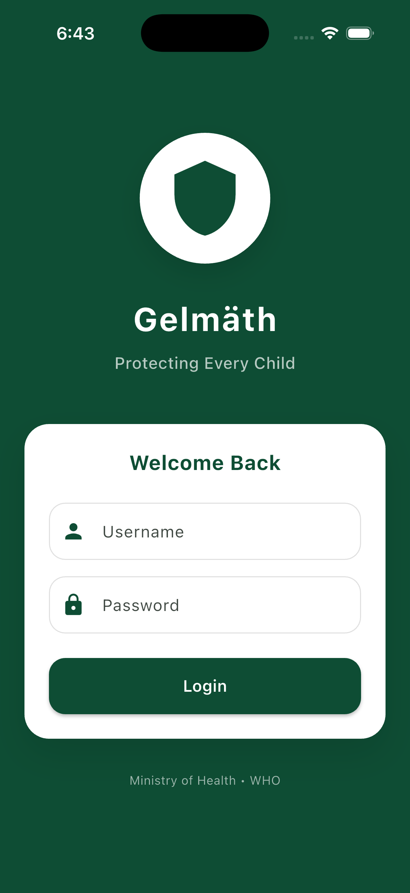
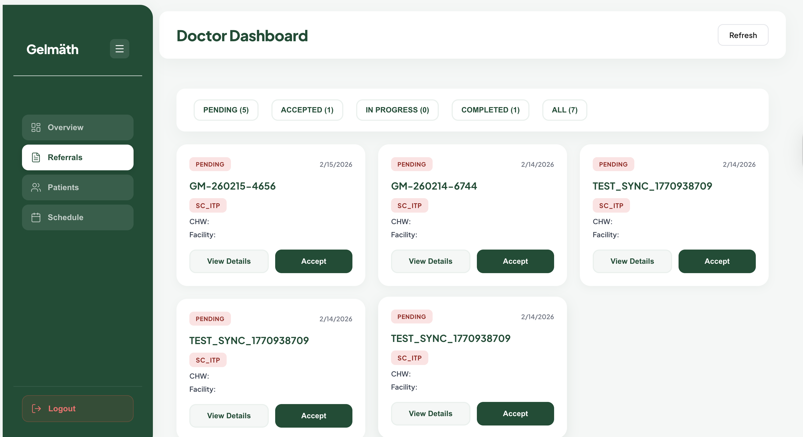

# CHAPTER 4: SYSTEM IMPLEMENTATION AND TESTING

## 4.1 Implementation and Coding

### 4.1.1 Introduction

This chapter provides a detailed explanation of the technical construction and validation of the Gelmëth CMAM ML System. It begins by outlining the specific software, frameworks, and technologies that form the system's foundation. The chapter then presents a graphical walkthrough of the key functionalities of both the Ministry of Health (MoH) administrative web dashboard and the Community Health Worker (CHW) mobile application, complete with illustrative code snippets. Finally, it outlines the complete implementation using Python and Django REST Framework for the backend, Random Forest classifiers (scikit-learn) for pathway prediction and quality checking, WHO LMS-based Z-score computation, and SQLite/PostgreSQL as the database layer.

### 4.1.2 Description of Implementation Tools and Technology

The implementation of the Gelmëth system relies on a combination of modern software development tools, machine learning frameworks, and cloud infrastructure. These tools are grouped according to the four main system components: the web dashboard, backend API, mobile application, and machine learning pipeline.

#### 4.1.2.1 Web Dashboard Technologies

**React 19.2:** Used as the primary library for building the MoH administrative dashboard because of its ability to create highly interactive and dynamic user interfaces. React's component-based architecture allowed the dashboard to be decomposed into reusable modules such as summary cards, trend charts, geographic heatmaps, and user management panels.

**JavaScript (ES6+):** Served as the core programming language for the web dashboard. Modern ES6+ features including arrow functions, destructuring, async/await, and template literals were used extensively to write clean, maintainable code throughout the dashboard codebase.

**React Router 7.13:** Managed client-side routing within the single-page application. It enabled seamless navigation between the login page, MoH dashboard, and Doctor dashboard without full page reloads, providing a smooth user experience.

**Recharts 3.7:** Powered all data visualization components on the dashboard, including pie charts for malnutrition distribution, bar charts for state-level comparisons, line charts for time-series trend analysis, and area charts for cumulative assessments. Recharts was chosen for its declarative approach and seamless integration with React.

**Leaflet 1.9 and React-Leaflet 5.0:** Provided interactive geographic mapping capabilities for the dashboard. The GeoHeatmap component uses Leaflet to render a map of South Sudan's ten states with circle markers indicating SAM/MAM prevalence rates, enabling MoH administrators to identify geographic hotspots.

**Axios 1.13:** Served as the HTTP client for communicating with the Django REST API. Axios interceptors were configured to automatically attach JWT tokens to every outgoing request and handle authentication errors uniformly across all API calls.

**jsPDF 4.1 and jsPDF-AutoTable 5.0:** Enabled the generation of downloadable PDF reports directly from the dashboard. MoH administrators can export assessment summaries, analytics reports, and facility-level statistics as professional PDF documents.

**Lucide React and React Icons:** Provided the icon libraries used throughout the dashboard interface, contributing to a modern and visually consistent design language.

#### 4.1.2.2 Backend API Technologies

**Python 3.13:** Served as the primary programming language for the backend API. Python was selected for its rich ecosystem of machine learning and data processing libraries, its readability, and its widespread adoption in both web development and scientific computing.

**Django 6.0:** Provided the core web framework for the backend, offering a robust ORM (Object-Relational Mapping) for database operations, a powerful migration system for schema evolution, and a built-in admin interface. Django's "batteries-included" philosophy reduced development time significantly.

**Django REST Framework (DRF) 3.16:** Extended Django with a comprehensive toolkit for building RESTful APIs. DRF provided serializers for data validation and transformation, viewsets for CRUD operations, permission classes for role-based access control, and pagination for handling large result sets.

**djangorestframework-simplejwt 5.3:** Implemented JSON Web Token (JWT) authentication for the API. This library generates access tokens (7-day lifetime) and refresh tokens (30-day lifetime) upon successful login, enabling stateless authentication suitable for both the mobile app and web dashboard.

**django-cors-headers 4.9:** Handled Cross-Origin Resource Sharing (CORS) configuration, allowing the React web dashboard and Flutter mobile app to communicate with the backend API from different origins.

**scikit-learn 1.8:** Provided the machine learning infrastructure for both the pathway classifier (Model 1) and the quality checker (Model 2). The RandomForestClassifier algorithm from scikit-learn was used to train both models, leveraging its ensemble learning approach for robust predictions.

**joblib 1.5:** Used for serializing and deserializing trained machine learning models. Both Model 1 (cmam_model.pkl) and Model 2 (model2_quality_classifier.pkl) are saved as joblib files and loaded at runtime by the backend for server-side inference.

**NumPy 2.4 and Pandas 3.0:** NumPy provided efficient numerical computation for feature vector construction during model inference, while Pandas was used for data manipulation during model training and dataset preprocessing.

**Gunicorn:** Served as the production WSGI HTTP server, running multiple worker processes to handle concurrent API requests efficiently behind an Nginx reverse proxy.

**Nginx:** Acted as the reverse proxy server in production, handling SSL termination, static file serving, load balancing, and request forwarding to the Gunicorn application server.

**PostgreSQL 15 (Production) / SQLite (Development):** PostgreSQL served as the production database, providing robust data integrity, concurrent access support, and advanced querying capabilities. SQLite was used during development for its zero-configuration simplicity.

#### 4.1.2.3 Mobile Application Technologies

**Flutter 3.0+:** Served as the cross-platform framework for building the mobile application. Flutter's single codebase approach allowed deployment to both Android and iOS platforms, while its widget-based architecture enabled rapid UI development with a native look and feel.

**Dart 3.0+:** Used as the programming language for the Flutter application. Dart's null safety features, strong typing, and asynchronous programming support (via async/await and Futures) contributed to writing reliable, maintainable code.

**sqflite 2.3:** Provided the local SQLite database for offline-first functionality. All assessments are first stored locally in SQLite, enabling Community Health Workers to conduct screenings in remote areas without internet connectivity.

**Provider 6.1:** Implemented the state management pattern for the application. Provider was chosen for its simplicity and efficiency in managing the reactive UI state, including locale changes, theme settings, and form data.

**flutter_secure_storage 9.0:** Handled secure storage of JWT tokens and user credentials on the device. Tokens are encrypted at rest using platform-specific secure storage mechanisms (Keychain on iOS, EncryptedSharedPreferences on Android).

**http 1.1:** Served as the HTTP client for communicating with the Django REST API. The http package was used for all network operations including authentication, assessment synchronization, and referral management.

**intl 0.20:** Provided internationalization and localization support. The application supports both English and Arabic languages, enabling deployment in linguistically diverse regions of South Sudan.

**flutter_svg 2.0:** Enabled rendering of SVG assets within the application, used for scalable icons and illustrations that maintain quality across different screen densities.

**path_provider 2.1 and shared_preferences 2.2:** path_provider provided access to the device file system for storing local data, while shared_preferences managed lightweight key-value settings such as dark mode preference and text size.

#### 4.1.2.4 Machine Learning and Data Science Tools

**Jupyter Notebook:** Served as the interactive development environment for all model training and evaluation. Five notebooks were developed covering data cleaning, visualization, Model 1 training, Model 2 training, and model explainability analysis.

**scikit-learn (RandomForestClassifier):** Both models use the Random Forest ensemble algorithm. Model 1 (pathway classifier) uses 100 trees with max depth 10 and balanced class weights. Model 2 (quality checker) uses 100 trees with max depth 10 and minimum samples split of 10.

**SHAP (SHapley Additive exPlanations):** Used for model explainability analysis, generating feature importance plots and SHAP summary plots for each prediction class (SC-ITP, OTP, TSFP). This enables transparent understanding of how the models make decisions.

**Matplotlib and Seaborn:** Provided the data visualization libraries for training notebooks, used to generate confusion matrix heatmaps, feature importance bar charts, and distribution plots during model development and evaluation.

#### 4.1.2.5 DevOps and Deployment Tools

**AWS EC2 (t3.medium):** Hosted the production backend server running Ubuntu 22.04 LTS with the Django application, Gunicorn WSGI server, and Nginx reverse proxy.

**AWS RDS (PostgreSQL):** Provided the managed production database with multi-AZ deployment, automated backups, and encryption at rest.

**AWS S3:** Used for static asset storage, including the React dashboard build files and model backup files.

**AWS CloudFront:** Served as the CDN (Content Delivery Network) for distributing the web dashboard globally with SSL/TLS encryption via Let's Encrypt certificates.

**AWS Route 53:** Managed DNS routing for the production domains.

**Git and GitHub:** Provided version control and collaborative development. The repository follows a structured branching strategy for feature development and deployment.

---

### 4.1.3 System Modules and Functionality

The Gelmëth system is organized into four interconnected modules, each serving a distinct role in the malnutrition screening workflow.

#### 4.1.3.1 Module 1: Mobile Application (CHW-Facing)

The mobile application is the primary tool used by Community Health Workers (CHWs) in the field. Built with Flutter and Dart, it provides an offline-first assessment workflow with local ML prediction, WHO Z-score computation, automatic data synchronization, and a complete referral management system. The application comprises fourteen distinct screens, each documented below.

**a) Login Screen**

The login screen provides secure JWT-based authentication. CHWs enter their username and password, which are validated against the backend API. Upon successful login, access and refresh tokens are stored securely in encrypted device storage using `flutter_secure_storage`. The screen features the Gelmëth system branding with the `logo_white.png` logo rendered at 280×280 pixels centrally. The user interface is fully localized, supporting both English and Arabic languages. A privacy policy link at the bottom navigates CHWs to the Privacy Policy screen, and the footer displays "© 2026 Gelmëth." If authentication fails, a user-friendly error message is displayed via a SnackBar notification.



*Figure 4.1: Mobile Application Login Screen — CHWs enter credentials for JWT authentication. The interface supports English and Arabic languages with the Gelmëth branding.*

```dart
// Authentication Service - JWT Login
class AuthService {
  static const String baseUrl = 'http://100.54.11.150/api/auth';
  static const storage = FlutterSecureStorage();
  
  static Future<Map<String, dynamic>?> login(
    String username, String password
  ) async {
    final response = await http.post(
      Uri.parse('$baseUrl/login/'),
      headers: {'Content-Type': 'application/json'},
      body: jsonEncode({
        'username': username,
        'password': password,
      }),
    );
    
    if (response.statusCode == 200) {
      final data = jsonDecode(response.body);
      // Store tokens securely
      await storage.write(key: 'access_token', value: data['access']);
      await storage.write(key: 'refresh_token', value: data['refresh']);
      // Store user profile information
      await storage.write(key: 'username', value: data['user']['username']);
      await storage.write(key: 'role', value: data['user']['role']);
      return data['user'];
    }
    return null;
  }
}
```

**b) Home Screen (CHW Dashboard)**

Upon successful login, the CHW is presented with the Home Screen, which serves as the central dashboard and navigation hub. The screen displays a personalized welcome header showing the CHW's full name and assigned health facility. Below the header, four summary statistic cards are rendered in a 2×2 grid layout:

- **Total Assessments** — the total number of assessments conducted by this CHW (blue icon)
- **SAM Cases** — count of Severe Acute Malnutrition cases identified (red icon)
- **MAM Cases** — count of Moderate Acute Malnutrition cases identified (orange icon)
- **Pending Referrals** — number of referrals awaiting doctor review (yellow icon)

These statistics are loaded dynamically from the local SQLite database, filtered by the logged-in CHW's username. A hero section displays a child health illustration (`child_image.jpg`), followed by two Quick Action buttons: **"Screen New Child"** (navigates to the Assessment Screen) and **"View Referrals"** (navigates to the Referrals Screen). The bottom navigation bar provides persistent access to the Home, Assessment, History, and Settings screens.


*Figure 4.2: Mobile Application Home Screen — The CHW Dashboard displays personalized statistics, quick actions, and the bottom navigation bar for navigating between screens.*

```dart
// Home Screen - Loads CHW-specific statistics from local database
Future<void> _loadStats() async {
  final assessments = await DatabaseService.instance.getAssessmentsByUsername(_username);
  final referrals = await DatabaseService.instance.getReferralsByUsername(_username);
  setState(() {
    _totalAssessments = assessments.length;
    _samCases = assessments.where((a) => a.clinicalStatus == 'SAM').length;
    _mamCases = assessments.where((a) => a.clinicalStatus == 'MAM').length;
    _pendingReferrals = referrals.where((r) => r['status'] == 'pending').length;
  });
}
```

**c) Assessment Screen**

The Assessment Screen is the core data collection interface where CHWs enter child clinical measurements. The form is organized into logical sections with robust input validation:

- **Child ID:** Auto-generated unique identifier in the format `CHILD_[timestamp]`, ensuring traceability for each screening.
- **State:** A dropdown selector populated with South Sudan's ten states (Central Equatoria, Eastern Equatoria, Jonglei, Lakes, Northern Bahr el Ghazal, Unity, Upper Nile, Warrap, Western Bahr el Ghazal, Western Equatoria).
- **Health Facility:** A dynamic dropdown that updates based on the selected state, populated from the `STATE_FACILITIES` constant mapping each state to its corresponding health facilities.
- **CHW Information:** The CHW's name, phone number, username, and facility are automatically pre-filled from the authenticated user profile stored in secure storage.
- **Sex:** A ChoiceChip selector with two options — Boy (Male) and Girl (Female) — styled with blue and pink color coding respectively.
- **Age in Months:** A numeric text field with validation enforcing the CMAM-eligible range of 6 to 59 months.
- **MUAC in Millimeters:** A numeric text field with validation enforcing the physiologically plausible range of 80 to 200 mm.
- **Edema:** A toggle selector (No = 0, Yes = 1) used to record the presence of bilateral pitting edema.
- **Appetite:** A dropdown with three options — Good, Poor, and Failed — corresponding to the CMAM appetite test.
- **Danger Signs:** A toggle selector (No = 0, Yes = 1) capturing the presence of any IMCI danger signs.

Upon pressing the **"Calculate Pathway"** button, the form data is first validated, then passes through the Quality Check Service. If the measurement falls near the SAM/MAM threshold (MUAC 113–117 mm), a Near Threshold Warning Dialog appears, advising the CHW to re-measure the child carefully before proceeding. If the quality check passes, the system navigates to the Processing Screen.


*Figure 4.3: Mobile Application Assessment Form — CHWs enter clinical measurements with auto-populated facility information and validated input fields.*

```dart
// Assessment form submission with quality check gatekeeper
void _calculatePathway() {
  if (!_formKey.currentState!.validate()) return;

  final qualityResult = QualityCheckService.checkQuality(
    muacMm: int.parse(_muacController.text),
    ageMonths: int.parse(_ageController.text),
    sex: _selectedSex == 'Boy' ? 'M' : 'F',
    edema: _selectedEdema,
    appetite: _selectedAppetite.toLowerCase(),
    dangerSigns: _selectedDangerSigns,
  );

  if (qualityResult['near_threshold'] == true) {
    _showNearThresholdDialog(qualityResult);  // Warn CHW to re-measure
  } else {
    _proceedToProcessing(qualityResult);       // Continue to pipeline
  }
}
```

**d) Processing Screen (AI Pipeline Animation)**

After the assessment form is submitted and passes the quality gate, the Processing Screen presents a visually animated five-step ML pipeline that processes the child's data in real time. Each step is displayed as a list tile with a progress indicator that transitions from a spinning loader to a green checkmark icon upon completion:

1. **Step 1 — Quality Check:** Validates measurement plausibility using the rule-based quality engine (Model 2 logic). Displays "Checking measurement quality..." during processing and "Quality check passed" upon completion.
2. **Step 2 — WHO Z-Score Calculation:** Computes the MUAC-for-age Z-score using WHO LMS reference tables loaded into memory. Displays the calculated Z-score value (e.g., "-2.34") upon completion.
3. **Step 3 — Clinical Status Determination:** Classifies the child's nutritional status according to CMAM 2017 guidelines: SAM (MUAC < 115mm or edema ≥ 1), MAM (115mm ≤ MUAC < 125mm), or Healthy (MUAC ≥ 125mm).
4. **Step 4 — AI Recommendation:** Runs the CMAM gate logic (PredictionService) to determine the recommended care pathway (SC-ITP, OTP, TSFP, or None) with a confidence score and clinical reasoning.
5. **Step 5 — Saving Assessment:** Saves the complete assessment record to the local SQLite database with all computed fields (Z-score, clinical status, pathway, confidence, reasoning).

Upon completion of all five steps, the screen automatically navigates to the Medical Document Screen. If the assessment results in an SC-ITP pathway, a referral record is automatically created and stored locally.


*Figure 4.4: Processing Screen — The animated five-step AI pipeline shows real-time progress as the child's data passes through quality checking, Z-score calculation, clinical classification, AI prediction, and local storage.*

```dart
// Five-step processing pipeline with animated progress
Future<void> _runPipeline() async {
  // Step 1: Quality Check
  setState(() => _currentStep = 0);
  await Future.delayed(const Duration(milliseconds: 800));
  final qualityResult = QualityCheckService.checkQuality(...);
  setState(() => _stepResults[0] = 'Quality check passed');

  // Step 2: Z-Score Calculation
  setState(() => _currentStep = 1);
  await Future.delayed(const Duration(milliseconds: 600));
  final zScore = ZScoreService.calculateMUACZScore(sex, ageMonths, muacCm);
  setState(() => _stepResults[1] = 'Z-Score: ${zScore?.toStringAsFixed(2)}');

  // Step 3: Clinical Status
  setState(() => _currentStep = 2);
  await Future.delayed(const Duration(milliseconds: 600));
  String clinicalStatus = _determineClinicalStatus(muacMm, edema);
  setState(() => _stepResults[2] = 'Status: $clinicalStatus');

  // Step 4: AI Recommendation
  setState(() => _currentStep = 3);
  await Future.delayed(const Duration(milliseconds: 800));
  final prediction = PredictionService.predictPathway(...);
  setState(() => _stepResults[3] = 'Pathway: ${prediction['pathway']}');

  // Step 5: Save to local database
  setState(() => _currentStep = 4);
  await DatabaseService.instance.insertAssessment(assessment);
  if (prediction['pathway'] == 'SC_ITP') {
    await DatabaseService.instance.insertReferral(referralData);
  }
  setState(() => _stepResults[4] = 'Assessment saved');

  // Navigate to Medical Document
  Navigator.pushReplacement(context, MaterialPageRoute(
    builder: (context) => MedicalDocumentScreen(assessment: assessment),
  ));
}
```

**e) Medical Document Screen (Assessment Form)**

The Medical Document Screen is the most comprehensive screen in the application. It renders a formal, printable "Gelmëth ASSESSMENT FORM" document designed to resemble an official medical assessment report. The document is organized into the following sections:

- **Document Information:** Displays the assessment ID, assessment date and time (formatted as "MMM dd, yyyy - HH:mm"), health facility name, state, and the CHW's name.
- **Patient Information:** Shows the child ID (highlighted in a blue container with monospace font for easy reading), age in months, and sex.
- **Anthropometric Measurements:** Displays the MUAC measurement in both millimeters and centimeters (auto-converted), the calculated MUAC-for-age Z-score, and edema status.
- **Clinical Assessment:** Shows the appetite test result, presence or absence of danger signs, and the clinical status (SAM, MAM, or Healthy) displayed with color-coded badges — red for SAM, orange for MAM, and green for Healthy.
- **AI-Assisted Recommendation:** Presents the AI model's confidence percentage in a progress bar format and the clinical reasoning behind the recommendation.
- **Final Care Pathway:** Displays the recommended care pathway (SC-ITP, OTP, TSFP, or None) in a colored badge. This field is **editable** — the CHW can override the AI recommendation if clinical judgment warrants a different pathway.
- **CHW Notes:** An editable text area where the CHW can add free-form clinical observations and notes about the child's condition.
- **Certification Section:** Displays the CHW's name and provides a signature line, formalizing the assessment as an official clinical document.

The screen supports an **Edit / Save** toggle mode: in view mode, the pathway and notes are read-only; pressing "Edit" enables modifications, and pressing "Save" commits changes. Three action buttons are displayed at the bottom:

- **"Refer to Doctor"** (shown only for SC-ITP cases): Navigates to the Doctor Selection Screen for urgent referral.
- **"Back to Home"**: Returns the CHW to the Home Screen.
- **"Print"**: Reserved button for future print functionality.


*Figure 4.5: Medical Document Screen — A formal assessment form showing complete clinical data, AI recommendation, editable pathway field, CHW notes, and certification section.*

```dart
// Medical Document Screen - Editable pathway and notes
Widget _buildEditablePathway() {
  return Column(
    children: [
      Text('Final Care Pathway', style: TextStyle(fontWeight: FontWeight.bold)),
      _isEditing
        ? DropdownButton<String>(
            value: _editedPathway,
            items: ['SC_ITP', 'OTP', 'TSFP', 'None']
                .map((p) => DropdownMenuItem(value: p, child: Text(p)))
                .toList(),
            onChanged: (value) => setState(() => _editedPathway = value!),
          )
        : Container(
            padding: EdgeInsets.all(12),
            decoration: BoxDecoration(
              color: _getPathwayColor(_editedPathway).withOpacity(0.1),
              borderRadius: BorderRadius.circular(8),
            ),
            child: Text(_editedPathway, style: TextStyle(
              fontWeight: FontWeight.bold,
              color: _getPathwayColor(_editedPathway),
            )),
          ),
    ],
  );
}
```

**f) Result Screen**

The Result Screen provides an alternative view of the assessment outcome with color-coded urgency indicators. The entire screen's accent color changes based on the severity of the diagnosis:

- **SC-ITP (Stabilization Center / Inpatient Therapeutic Program):** Red urgency color with a red status indicator bar, signaling critical cases requiring immediate inpatient care.
- **OTP (Outpatient Therapeutic Program):** Orange urgency color, indicating severe malnutrition manageable on an outpatient basis.
- **TSFP (Targeted Supplementary Feeding Program):** Yellow urgency color, indicating moderate malnutrition.
- **None (Healthy):** Green color indicating no malnutrition detected.

The screen displays four information cards:

1. **Status Card:** Pathway name, pathway description explaining the clinical meaning (e.g., "Severe Acute Malnutrition requiring inpatient stabilization care"), and urgency badge.
2. **Child Information Card:** Child ID, sex, age, and MUAC measurement.
3. **Clinical Assessment Card:** Z-score, edema status, appetite, danger signs, and clinical status.
4. **Recommendation Card:** Confidence percentage, reasoning provided by the AI model.

The assessment is automatically synced to the backend if network connectivity is available. Action buttons include:

- **"Refer to Doctor"** (for SC-ITP cases): Navigates to the Doctor Selection Screen.
- **"Create Referral"** (for non-SC-ITP cases that still need referral): Creates a local referral record.
- **"Complete Assessment"**: Returns the CHW to the Home Screen.


*Figure 4.6: Result Screen — Color-coded assessment results with urgency indicators. SC-ITP cases display in red, OTP in orange, TSFP in yellow, and Healthy in green.*

```dart
// Color-coded urgency system
Color _getUrgencyColor(String pathway) {
  switch (pathway) {
    case 'SC_ITP': return Colors.red;
    case 'OTP':    return Colors.orange;
    case 'TSFP':   return Colors.amber;
    default:       return Colors.green;
  }
}

// Auto-sync assessment to backend
Future<void> _syncToBackend() async {
  final result = await ApiService.syncAssessment(widget.assessment);
  if (result != null) {
    ScaffoldMessenger.of(context).showSnackBar(
      const SnackBar(content: Text('Assessment synced successfully')),
    );
  }
}
```

**g) History Screen**

The History Screen displays a chronological list of all past assessments conducted by the logged-in CHW, stored in the local SQLite database. Each assessment entry is rendered as a card containing:

- **Child ID:** Displayed with a person icon for easy identification.
- **Pathway Badge:** A color-coded chip (red for SC-ITP, orange for OTP, yellow for TSFP, green for None) showing the recommended care pathway.
- **Clinical Details Chips:** Three informational chips displaying the child's sex, age (in months), and MUAC measurement (in mm).
- **Z-Score:** The calculated MUAC-for-age Z-score.
- **Clinical Status:** The classified nutritional status (SAM, MAM, or Healthy).
- **Assessment Date:** Formatted timestamp of when the assessment was conducted.
- **Sync Status:** A cloud icon indicator — a cloud-with-checkmark icon (green) for synced assessments and a cloud-with-arrow icon (orange) for assessments pending synchronization.

Tapping on any assessment card opens the Medical Document Screen with the full assessment details. The screen also includes a **"Clear History"** button in the app bar that triggers a confirmation dialog before deleting all local assessment records.


*Figure 4.7: History Screen — Chronological list of all CHW assessments with pathway badges, clinical details, and sync status indicators.*

```dart
// Database Service - Load assessments filtered by CHW username
Future<void> _loadAssessments() async {
  final username = await AuthService.getUsername();
  final allAssessments = await DatabaseService.instance.getAllAssessments();
  setState(() {
    _assessments = allAssessments
        .where((a) => a.chwUsername == username)
        .toList()
      ..sort((a, b) => b.timestamp.compareTo(a.timestamp));
  });
}
```

**h) Referrals Screen**

The Referrals Screen displays all referrals created by the logged-in CHW, enabling them to track the status and lifecycle of referred cases. Each referral is rendered as a card with the following information:

- **Child ID and Pathway Badge:** Identifying the referred child and the care pathway.
- **Assessment Details:** Sex, age, MUAC measurement, Z-score, and clinical status chips.
- **Referral Notes:** Any notes added during the referral creation.
- **Status Indicator:** Color-coded status badge — orange for "Pending" referrals and green for "Completed" referrals.
- **Assessment Date:** When the original assessment was conducted.

For referrals with a "Pending" status, two action buttons are displayed:

- **"Complete"**: Marks the referral as completed, updating the local database.
- **"Cancel"**: Cancels the pending referral with confirmation.


*Figure 4.8: Referrals Screen — CHW view of all created referrals with status tracking and action buttons for pending cases.*

```dart
// Load referrals filtered by CHW username
Future<void> _loadReferrals() async {
  final username = await AuthService.getUsername();
  final allReferrals = await DatabaseService.instance.getAllReferrals();
  setState(() {
    _referrals = allReferrals
        .where((r) => r['chw_username'] == username)
        .toList();
  });
}
```

**i) Doctor Selection Screen (Urgent Referral)**

When a CHW creates an urgent referral for an SC-ITP case, the Doctor Selection Screen is presented. This screen features a prominent red "URGENT REFERRAL" header indicating the critical nature of the case. The screen fetches a list of active doctors from the backend API and displays each doctor as a selectable card showing:

- **Doctor Name:** Full name of the medical officer.
- **Health Facility:** The facility where the doctor is stationed.
- **Phone Number:** Contact information for direct communication.

The CHW selects a doctor by tapping the corresponding card, which highlights the selection with a colored border. Below the doctor list, a text area allows the CHW to enter **Referral Notes** providing clinical context for the receiving doctor. Pressing the **"Send Referral"** button (styled in red for urgency) creates the referral record and associates it with the selected doctor.


*Figure 4.9: Doctor Selection Screen — CHWs select a doctor from the list of active medical officers and provide referral notes for urgent SC-ITP cases.*

```dart
// Fetch active doctors from backend API
Future<void> _loadDoctors() async {
  final response = await ApiService.getActiveDoctors();
  if (response != null) {
    setState(() {
      _doctors = (response as List)
          .map((d) => {'name': d['full_name'], 'facility': d['facility'], 
                       'phone': d['phone'], 'id': d['id']})
          .toList();
    });
  }
}
```

**j) Settings Screen**

The Settings Screen provides user profile management, application customization, and data synchronization controls. It is organized into four sections:

1. **Profile Card:** Displays the CHW's profile information including an avatar icon, full name, username, assigned health facility, state, phone number, and role (shown as a colored chip — blue for CHW, purple for Doctor, red for MoH Admin).

2. **App Settings:**
   - **Dark Mode Toggle:** Switches the application between light and dark themes. The preference is persisted locally using `shared_preferences`.
   - **Text Size Slider:** An adjustable slider ranging from 80% to 150% of the default text size, enabling accessibility for users with visual impairments. The current percentage is displayed alongside the slider.
   - **Language Dropdown:** Allows switching between English and Arabic (العربية). The selection triggers a locale change across the entire application using the Provider state management system.

3. **Data Sync:**
   - **Sync Button:** Triggers a manual synchronization of all unsynced assessments and referrals to the backend server. During synchronization, a progress indicator is displayed, and the button text changes to "Syncing..." The results are displayed via a SnackBar notification showing the count of successfully synced records.

4. **App Information:**
   - **App Version:** Displays "Version 1.0.0"
   - **Guidelines:** States adherence to "CMAM South Sudan 2017 Guidelines"
   - **WHO Standards:** States adherence to "WHO Child Growth Standards"

A **"Logout"** button at the bottom clears all stored tokens and user data from secure storage and navigates back to the Login Screen.


*Figure 4.10: Settings Screen — Profile information, app customization (dark mode, text size, language), data sync controls, and application information.*

```dart
// Settings - Language change with Provider
void _changeLanguage(String languageCode) {
  final provider = Provider.of<LocaleProvider>(context, listen: false);
  provider.setLocale(Locale(languageCode));
  SharedPreferences.getInstance().then((prefs) {
    prefs.setString('language', languageCode);
  });
}

// Settings - Manual data sync
Future<void> _syncData() async {
  setState(() => _isSyncing = true);
  final result = await SyncService.syncAssessments();
  final referralResult = await SyncService.syncReferrals();
  setState(() => _isSyncing = false);
  ScaffoldMessenger.of(context).showSnackBar(
    SnackBar(content: Text('${result['message']} | ${referralResult['message']}')),
  );
}
```

**k) Privacy Policy and Ethics Screen**

The Privacy Policy Screen presents comprehensive ethical, legal, and privacy information organized into six expandable sections:

1. **Ethical Considerations:** Explains the system's commitment to ethical AI practices in healthcare, non-replacement of clinical judgment, and alignment with CMAM guidelines.
2. **Data Privacy & Security:** Details the technical security measures implemented: AES-256 encryption for data at rest, TLS 1.3 for data in transit, PBKDF2 password hashing, JWT token-based authentication, and role-based access control.
3. **Child Welfare:** Describes the system's focus on pediatric welfare, adherence to WHO growth standards, and the referral escalation protocol for critical cases.
4. **Disclaimer & Limitations:** Displayed in a **red warning box**, this section clearly states that the system is an AI-assisted screening tool and not a diagnostic device. It emphasizes that all recommendations must be reviewed by qualified healthcare professionals.
5. **Terms of Use:** Outlines the acceptable use policies, user responsibilities, and conditions for system access.
6. **Contact & Support:** Provides contact information for technical support and system administrators.


*Figure 4.11: Privacy Policy Screen — Six expandable sections covering ethics, data privacy (AES-256, TLS 1.3), child welfare, disclaimers, terms of use, and contact information.*

**l) Data Synchronization Service**

The Sync Service manages background data synchronization from the mobile device to the backend server. When network connectivity is available, unsynced assessments and referrals are uploaded in bulk via REST API calls. The service iterates through all locally stored records marked as `synced = 0`, transmits each to the backend, and upon successful upload (HTTP 201), marks the record as synced in the local database.

```dart
// Sync Service - Offline-to-Online data synchronization
class SyncService {
  static Future<Map<String, dynamic>> syncAssessments() async {
    final unsyncedAssessments =
        await DatabaseService.instance.getUnsyncedAssessments();

    if (unsyncedAssessments.isEmpty) {
      return {'success': true, 'message': 'No assessments to sync', 'count': 0};
    }

    final headers = await AuthService.getAuthHeaders();
    int successCount = 0;

    for (var assessment in unsyncedAssessments) {
      final response = await http.post(
        Uri.parse('$baseUrl/assessments/'),
        headers: headers,
        body: jsonEncode(assessment.toApiMap()),
      );

      if (response.statusCode == 201) {
        await DatabaseService.instance.markAsSynced(int.parse(assessment.id!));
        successCount++;
      }
    }

    return {
      'success': successCount > 0,
      'message': 'Synced $successCount of ${unsyncedAssessments.length}',
      'count': successCount
    };
  }
}
```

**m) Local Database Service**

The DatabaseService implements the offline-first data persistence layer using sqflite. It manages a local SQLite database (`cmam_assessments.db`) with tables for assessments and referrals. Key operations include:

- **Assessment CRUD:** Insert, retrieve (all, by username, by ID), update, and delete assessment records.
- **Referral CRUD:** Insert, retrieve (all, by username), update status, and delete referral records.
- **Sync Operations:** Query unsynced records (`synced = 0`) and mark records as synced after successful upload.
- **Statistics:** Aggregate queries for the Home Screen dashboard cards (total, SAM count, MAM count by username).

```dart
// Database Service - SQLite offline storage
class DatabaseService {
  static final DatabaseService instance = DatabaseService._init();
  static Database? _database;

  Future<Database> get database async {
    if (_database != null) return _database!;
    _database = await _initDB('cmam_assessments.db');
    return _database!;
  }

  Future<List<ChildAssessment>> getAssessmentsByUsername(String username) async {
    final db = await database;
    final maps = await db.query('assessments',
        where: 'chw_username = ?', whereArgs: [username],
        orderBy: 'timestamp DESC');
    return maps.map((map) => ChildAssessment.fromMap(map)).toList();
  }

  Future<List<ChildAssessment>> getUnsyncedAssessments() async {
    final db = await database;
    final maps = await db.query('assessments', where: 'synced = ?', whereArgs: [0]);
    return maps.map((map) => ChildAssessment.fromMap(map)).toList();
  }
}
```

#### 4.1.3.2 Module 2: Backend REST API

The backend API is built with Django REST Framework and serves as the central data hub connecting the mobile application, web dashboard, and machine learning models.

**a) Data Models**

The system defines four primary data models:

```python
# Assessment Model - Core data entity
class Assessment(models.Model):
    # Child information
    child_id = models.CharField(max_length=50)
    sex = models.CharField(max_length=1, choices=[('M', 'Male'), ('F', 'Female')])
    age_months = models.IntegerField()
    muac_mm = models.IntegerField()
    edema = models.IntegerField(default=0)
    appetite = models.CharField(max_length=20)
    danger_signs = models.IntegerField(default=0)

    # ML-derived results
    muac_z_score = models.FloatField(null=True, blank=True)
    clinical_status = models.CharField(max_length=20, null=True, blank=True)
    recommended_pathway = models.CharField(max_length=20, null=True, blank=True)
    confidence = models.FloatField(null=True, blank=True)

    # CHW information
    chw_user = models.ForeignKey(CHWUser, on_delete=models.SET_NULL, null=True)
    chw_username = models.CharField(max_length=150, default='')
    chw_facility = models.CharField(max_length=255, blank=True, default='')
    chw_state = models.CharField(max_length=100, blank=True, default='')

    # Timestamps
    assessment_date = models.DateTimeField(default=timezone.now)
    synced = models.BooleanField(default=True)

    class Meta:
        ordering = ['-assessment_date']
        indexes = [
            models.Index(fields=['chw_username', '-assessment_date']),
            models.Index(fields=['child_id']),
        ]
```

```python
# CHW User Model - Extended Django User with role-based access
class CHWUser(AbstractUser):
    ROLE_CHOICES = [
        ('MOH_ADMIN', 'MoH Administrator'),
        ('CHW', 'Community Health Worker'),
        ('DOCTOR', 'Doctor'),
    ]

    role = models.CharField(max_length=20, choices=ROLE_CHOICES, default='CHW')
    phone = models.CharField(max_length=20, blank=True)
    state = models.CharField(max_length=100, blank=True)
    facility = models.CharField(max_length=200, blank=True)
    is_active_chw = models.BooleanField(default=True)
```

```python
# Referral Model - Links assessments to doctors
class Referral(models.Model):
    STATUS_CHOICES = [
        ('pending', 'Pending'),
        ('accepted', 'Accepted'),
        ('in_progress', 'In Progress'),
        ('completed', 'Completed'),
        ('rejected', 'Rejected'),
    ]

    assessment = models.ForeignKey(Assessment, on_delete=models.CASCADE)
    child_id = models.CharField(max_length=50)
    pathway = models.CharField(max_length=50)
    status = models.CharField(max_length=20, choices=STATUS_CHOICES, default='pending')
    chw_user = models.ForeignKey(CHWUser, on_delete=models.SET_NULL, null=True)
    doctor_user = models.ForeignKey(CHWUser, on_delete=models.SET_NULL, null=True, blank=True)
    doctor_notes = models.TextField(blank=True, null=True)
```

**b) API Endpoints and Views**

The API follows RESTful conventions with role-based access control:

```python
# Assessment ViewSet - Role-based CRUD with bulk sync support
class AssessmentViewSet(viewsets.ModelViewSet):
    queryset = Assessment.objects.all()
    permission_classes = [IsAuthenticated]

    def get_queryset(self):
        # MoH admins see all assessments; CHWs see only their own
        if self.request.user.role == 'MOH_ADMIN':
            return Assessment.objects.all()
        return Assessment.objects.filter(chw_username=self.request.user.username)

    @action(detail=False, methods=['post'])
    def bulk_create(self, request):
        """Bulk upload assessments from mobile app sync."""
        assessments_data = request.data if isinstance(request.data, list) else [request.data]
        serializer = AssessmentCreateSerializer(data=assessments_data, many=True)
        if serializer.is_valid():
            serializer.save()
            return Response({
                'message': f'{len(assessments_data)} assessments synced successfully',
                'count': len(assessments_data)
            }, status=status.HTTP_201_CREATED)
        return Response({'error': 'Validation failed', 'details': serializer.errors},
                        status=status.HTTP_400_BAD_REQUEST)
```

```python
# JWT Authentication - Login endpoint
@api_view(['POST'])
@permission_classes([AllowAny])
def login(request):
    serializer = LoginSerializer(data=request.data)
    serializer.is_valid(raise_exception=True)

    user = serializer.validated_data['user']
    refresh = RefreshToken.for_user(user)

    return Response({
        'access': str(refresh.access_token),
        'refresh': str(refresh),
        'user': {
            'id': user.id,
            'username': user.username,
            'full_name': user.get_full_name(),
            'role': user.role,
            'facility': user.facility,
            'state': user.state,
        }
    })
```

**c) Quality Check Service (Server-Side Model 2)**

The backend also provides a server-side quality checking endpoint that uses the trained scikit-learn model for more accurate predictions compared to the rule-based mobile implementation:

```python
# Quality Check Service - Hybrid ML + Rule-Based Detection
class QualityCheckService:
    def __init__(self):
        model_path = os.path.join(os.path.dirname(__file__), '..', '..',
                                  'model2_quality_classifier.pkl')
        self.model = joblib.load(model_path)

    def check_quality(self, muac_mm, age_months, sex, edema, appetite, danger_signs):
        flags = []

        # Rule-based checks (always run)
        if muac_mm < 50 or muac_mm > 200: flags.append('unit_error')
        if age_months < 6 or age_months > 59: flags.append('age_out_of_range')
        if muac_mm > 130 and edema >= 2: flags.append('impossible_combo')

        # ML-based prediction using trained Random Forest model
        near_threshold = 1 if 113 <= muac_mm <= 117 else 0
        unit_suspect = 1 if muac_mm < 50 or muac_mm > 200 else 0
        age_suspect = 1 if age_months < 6 or age_months > 59 else 0
        sex_encoded = 1 if sex == 'M' else 0
        appetite_encoded = {'good': 0, 'poor': 1, 'failed': 2}.get(appetite, 2)

        X = np.array([[muac_mm, age_months, sex_encoded, edema,
                        appetite_encoded, danger_signs,
                        near_threshold, unit_suspect, age_suspect]])

        pred = self.model.predict(X)[0]
        proba = self.model.predict_proba(X)[0]
        ml_status = 'SUSPICIOUS' if pred == 1 else 'OK'

        return {
            'status': 'SUSPICIOUS' if (flags or ml_status == 'SUSPICIOUS') else 'OK',
            'confidence': float(proba[pred]),
            'flags': flags,
            'recommendation': self._get_recommendation(flags),
        }
```

**d) Analytics Endpoints**

The analytics module provides aggregated data for the MoH dashboard:

```python
# National Summary - SAM/MAM/Healthy prevalence statistics
@api_view(['GET'])
@permission_classes([IsAuthenticated])
def national_summary(request):
    queryset = Assessment.objects.all()
    total = queryset.count()
    sam = queryset.filter(clinical_status='SAM').count()
    mam = queryset.filter(clinical_status='MAM').count()
    healthy = queryset.filter(clinical_status='Healthy').count()

    return Response({
        'total_assessments': total,
        'sam_count': sam,
        'mam_count': mam,
        'healthy_count': healthy,
        'sam_prevalence': round((sam / total * 100) if total > 0 else 0, 1),
        'mam_prevalence': round((mam / total * 100) if total > 0 else 0, 1),
    })

# Time Series - Daily trend data for line charts
@api_view(['GET'])
@permission_classes([IsAuthenticated])
def time_series(request):
    data = Assessment.objects.annotate(
        date=TruncDate('assessment_date')
    ).values('date').annotate(
        sam_count=Count('id', filter=Q(clinical_status='SAM')),
        mam_count=Count('id', filter=Q(clinical_status='MAM')),
        healthy_count=Count('id', filter=Q(clinical_status='Healthy'))
    ).order_by('date')
    return Response([{...} for d in data])

# State Trends - Per-state breakdown for geographic analysis
@api_view(['GET'])
@permission_classes([IsAuthenticated])
def state_trends(request):
    states = Assessment.objects.values('chw_state').annotate(
        total=Count('id'),
        sam_count=Count('id', filter=Q(clinical_status='SAM')),
        mam_count=Count('id', filter=Q(clinical_status='MAM')),
    ).filter(chw_state__isnull=False).exclude(chw_state='').order_by('-total')
    return Response([...])
```

**e) URL Routing Structure**

```python
# Main URL configuration
urlpatterns = [
    path('admin/', admin.site.urls),
    path('api/auth/', include('users.urls')),        # Authentication & user management
    path('api/', include('assessments.urls')),        # Assessments & quality check
    path('api/analytics/', include('analytics.urls')),# Analytics endpoints
    path('api/referrals/', include('referrals.urls')),# Referral management
]
```

| Endpoint | Method | Description |
|----------|--------|-------------|
| `/api/auth/login/` | POST | User authentication, returns JWT tokens |
| `/api/auth/me/` | GET | Get current user profile |
| `/api/auth/users/` | GET/POST | User CRUD (MoH Admin only) |
| `/api/assessments/` | GET/POST | List/create assessments |
| `/api/assessments/bulk_create/` | POST | Bulk upload from mobile sync |
| `/api/assessments/check-quality/` | POST | Server-side quality check (Model 2) |
| `/api/assessments/statistics/` | GET | Assessment count statistics |
| `/api/analytics/national-summary/` | GET | National SAM/MAM/Healthy summary |
| `/api/analytics/state-trends/` | GET | Per-state assessment breakdown |
| `/api/analytics/time-series/` | GET | Daily time series trend data |
| `/api/referrals/` | GET/POST | Referral CRUD |
| `/api/referrals/bulk_create/` | POST | Bulk referral upload |
| `/api/health/` | GET | API health check |

#### 4.1.3.3 Module 3: Web Dashboard (MoH and Doctor Facing)

The React web dashboard provides two role-based interfaces: the **MoH Administrator Dashboard** (ten tabs) and the **Doctor Dashboard** (four tabs). Both dashboards share a common authentication system with role-based routing.

**a) Web Login Screen**

The web login screen features a split-screen design. The left panel displays the Gelmëth system branding with a dark-themed hero section showcasing three feature highlights (AI-Powered MUAC Analysis, Real-time CHW Monitoring, Predictive Analytics) and three statistical counters. The right panel contains the login form with username and password fields and a **role toggle** that allows users to select their role as either "MoH Admin" or "Doctor." Upon successful authentication, the system routes the user to the appropriate dashboard based on the selected role. The screen includes a link to the privacy policy and terms of service.


*Figure 4.12: Web Dashboard Login Screen — Split-screen design with Gelmëth branding, feature highlights, and role-based authentication (MoH Admin or Doctor).*

```javascript
// Role-based routing after authentication
function App() {
  const [isAuthenticated, setIsAuthenticated] = useState(false);
  const [userRole, setUserRole] = useState('MOH_ADMIN');

  return (
    <Router>
      <Routes>
        <Route path="/login" element={<Login onLogin={handleLogin} />} />
        <Route path="/moh" element={
          isAuthenticated && userRole === 'MOH_ADMIN'
            ? <MoHDashboard onLogout={handleLogout} />
            : <Navigate to="/login" replace />
        } />
        <Route path="/doctor" element={
          isAuthenticated && userRole === 'DOCTOR'
            ? <DoctorDashboard onLogout={handleLogout} />
            : <Navigate to="/login" replace />
        } />
      </Routes>
    </Router>
  );
}
```

---

##### MoH Administrator Dashboard

The MoH Administrator Dashboard is a comprehensive ten-tab interface providing national-level visibility into malnutrition screening operations across South Sudan. A persistent sidebar on the left provides navigation between tabs, and a top toolbar features a **date range filter** (7 days, 30 days, 90 days, Quarter, Half Year, 1 Year), a **Refresh** button, and an **Export** dropdown (PDF, Excel, CSV, JSON).

**b) Overview Tab**

The Overview tab serves as the primary landing page for MoH administrators, offering a high-level summary of the national malnutrition screening program. It displays:

- **Six KPI Summary Cards** arranged in a 3×2 grid: Total Assessments, SAM Cases, MAM Cases, Healthy Cases, Active CHWs, and Pending Referrals. Each card displays the count value with a **trend indicator arrow** showing the percentage change compared to the previous period (green up-arrow for improvement, red down-arrow for deterioration).
- **Malnutrition Distribution Pie Chart:** A Recharts PieChart showing the proportional breakdown of SAM, MAM, and Healthy cases with interactive tooltips and a legend.
- **Assessments by State Bar Chart:** A BarChart comparing total assessments across South Sudan's ten states, enabling quick identification of states with the highest screening activity.
- **Assessment Trends Area Chart:** An AreaChart displaying the cumulative SAM, MAM, and Healthy case trends over the selected time period, allowing administrators to visualize improving or worsening trends.


*Figure 4.13: MoH Dashboard — Overview Tab showing KPI summary cards with trend indicators, malnutrition distribution pie chart, state-level comparison bar chart, and assessment trends area chart.*

**c) Analytics Tab**

The Analytics tab provides deeper statistical analysis of malnutrition data across multiple dimensions:

- **Monthly Assessment Trends Line Chart:** A LineChart plotting SAM, MAM, and Healthy case counts over monthly intervals, enabling identification of seasonal patterns and long-term trends.
- **Age Group Distribution Bar Chart:** A BarChart breaking down malnutrition cases by age groups (6–11, 12–23, 24–35, 36–47, 48–59 months), revealing which age cohorts are most affected.
- **Gender Distribution Bar Chart:** A BarChart comparing SAM, MAM, and Healthy cases between male and female children, highlighting gender-based disparities.
- **State Analytics Table:** A detailed table listing each state with columns for total assessments, SAM count, MAM count, Healthy count, SAM rate (%), and MAM rate (%), sortable by any column.


*Figure 4.14: MoH Dashboard — Analytics Tab with monthly trends, age group distribution, gender breakdown, and state-level analytics table.*

**d) Facilities Tab**

The Facilities tab provides a directory of all health facilities with operational metrics:

- **Facility Table:** Each row displays the facility name, state, total assessments conducted, SAM count, MAM count, number of active CHWs, and the date of the last assessment.
- **Facility Drill-Down:** Clicking on a facility row expands a detailed view showing:
  - Assessment metrics cards (total, SAM, MAM, Healthy) specific to that facility.
  - A malnutrition distribution PieChart for the facility.
  - A list of all CHWs assigned to the facility with their individual assessment counts and last activity dates.


*Figure 4.15: MoH Dashboard — Facilities Tab showing the facility directory with drill-down analytics for individual health facilities.*

**e) Users Tab (User Management)**

The Users tab provides complete user account management capabilities for MoH administrators. It features:

- **User Metrics Cards:** Four summary cards displaying the count of total CHWs, Doctors, Admins, and Inactive Users.
- **User Table:** A comprehensive table listing all system users with columns for username, full name, role (color-coded badge), state, facility, phone number, status (Active/Inactive), and action buttons (Edit, Delete).
- **Create User Button:** Opens the UserModal — a form dialog with nine fields: username, password, confirm password, first name, last name, phone number, state (dropdown of 10 South Sudan states), facility (dynamic dropdown filtered by selected state), and role (dropdown: CHW, Doctor, MoH Admin).
- **Edit User:** Opens the same UserModal pre-populated with the user's existing data for modification.
- **Delete User:** Triggers a confirmation dialog before removing the user account.

The `STATE_FACILITIES` constant maps each of South Sudan's ten states to its corresponding health facilities, ensuring data integrity and consistency across the system.


*Figure 4.16: MoH Dashboard — Users Tab with user metrics cards, user directory table, and the Create/Edit User modal dialog.*

**f) Geo Heatmap Tab**

The Geo Heatmap tab renders an interactive geographic visualization of malnutrition prevalence across South Sudan using Leaflet.js. Key features include:

- **Interactive Map:** A Leaflet map centered on South Sudan (coordinates 7.8, 30.0) with OpenStreetMap tiles at zoom level 6.
- **State Circle Markers:** Each of South Sudan's ten states is represented by a circle marker positioned at its geographic center. The markers are:
  - **Color-coded** by SAM rate: red (SAM rate > 30%), orange (> 20%), yellow (> 10%), green (≤ 10%).
  - **Sized proportionally** to the total number of assessments conducted in that state (radius ranges from 15 to 40 pixels).
- **Interactive Popups:** Clicking on a state marker displays a popup with the state name, total assessments, SAM count, MAM count, and Healthy count.
- **Map Legend:** A positioned legend explaining the color coding system.
- **State Statistics Table:** Below the map, a table lists all states with their total assessments, SAM count, MAM count, SAM rate (%), and a visual color indicator.


*Figure 4.17: MoH Dashboard — Geo Heatmap Tab showing the interactive Leaflet map of South Sudan with color-coded and size-proportional state markers, popups, and the state statistics table.*

**g) Advanced Metrics Tab**

The Advanced Metrics tab provides performance analytics for individual field staff:

- **CHW Activity Bar Chart:** A horizontal BarChart ranking all Community Health Workers by their total assessment count, enabling identification of the most active and least active CHWs.
- **Doctor Activity Bar Chart:** A BarChart ranking doctors by the number of referrals they have processed (accepted, in-progress, and completed).
- **CHW Performance Table:** A detailed table listing each CHW with columns for name, facility, state, total assessments, SAM cases detected, MAM cases detected, last active date, and a performance rating indicator.
- **Doctor Performance Table:** A table listing each doctor with referral counts by status (pending, accepted, completed, rejected) and average response time.


*Figure 4.18: MoH Dashboard — Advanced Metrics Tab with CHW and Doctor activity charts and performance tables.*

**h) Reports Tab**

The Reports tab enables MoH administrators to generate and download professional PDF reports. Four report types are available:

1. **National Summary Report:** Includes national-level KPI metrics, malnutrition distribution pie chart, assessment trend line chart, and a summary table. Generated as a multi-page PDF using jsPDF with auto-tables.
2. **State-Level Analysis Report:** Includes a state comparison bar chart and a detailed state-by-state table with SAM/MAM/Healthy counts and prevalence rates.
3. **CHW Performance Report:** Includes a CHW activity bar chart, a stacked bar chart showing SAM/MAM/Healthy distributions per CHW, and a performance ranking table.
4. **Facility Capacity Report:** Includes a facility utilization bar chart, a capacity distribution pie chart, and a facility metrics table.

Each report type is selectable from a card-based interface. Clicking **"Generate Report"** produces a PDF document that automatically downloads to the user's browser.


*Figure 4.19: MoH Dashboard — Reports Tab with four report types (National Summary, State-Level Analysis, CHW Performance, Facility Capacity) and PDF generation.*

**i) ML Explainability Tab**

The ML Explainability tab provides transparent insight into how the AI models make predictions, implementing a SHAP-like explainability interface:

- **Assessment List Panel (Left):** Displays the 50 most recent assessments as selectable list items, each showing the child ID, MUAC value, and pathway result.
- **AI Explanation Panel (Right):** When an assessment is selected, this panel displays:
  - **Pathway Probabilities:** Three horizontal progress bars showing the model's confidence for each pathway (SC-ITP, OTP, TSFP) as percentages.
  - **Feature Importance Bar Chart:** A BarChart showing how each input feature (MUAC, age, sex, edema, appetite, danger signs) contributed to the prediction for the selected assessment.
  - **Detailed Feature Analysis:** A table listing each feature with its value, importance score, and a plain-language explanation of its contribution (e.g., "MUAC of 98mm is well below the 115mm SAM threshold, strongly indicating severe malnutrition").
  - **CMAM Compliance Badge:** A badge confirming whether the AI recommendation aligns with the CMAM 2017 guideline rules.


*Figure 4.20: MoH Dashboard — ML Explainability Tab showing pathway probabilities, feature importance chart, detailed feature analysis, and CMAM compliance verification.*

**j) Predictive Analytics Tab**

The Predictive Analytics tab provides forward-looking malnutrition trend forecasting to support proactive resource allocation:

- **Early Warning Alerts Grid:** A set of alert cards highlighting states or regions where SAM rates are projected to increase, displayed with severity color coding (red for critical, orange for warning, yellow for watch).
- **SAM/MAM Trend Indicators:** Summary indicators showing whether national SAM and MAM rates are trending upward, stable, or downward over the next 3 months.
- **Forecast Area Chart:** An AreaChart combining 6 months of historical SAM/MAM data with 3 months of projected forecast data (shown with dashed lines), enabling visual assessment of trajectory.
- **Resource Requirements Table:** Based on the forecast, the system estimates required resources: RUTF sachets needed, CSB+ (kg) required, number of CHWs to deploy, SC-ITP bed capacity needed, and OTP service capacity.
- **State-Level Forecast Table:** A detailed table showing predicted SAM count, MAM count, trend direction, and risk level for each state over the next quarter.


*Figure 4.21: MoH Dashboard — Predictive Analytics Tab with early warning alerts, forecast area chart, resource requirement estimates, and state-level forecast table.*

**k) Settings Tab**

The Settings tab provides system administration and configuration options:

- **System Information:** Displays API server URL, system version, last data refresh timestamp, and database status.
- **Data Management:** Options for data export (full database export) and data purge (with confirmation dialog).
- **Notification Settings:** Toggles for email notifications on new SAM cases, weekly summary reports, and system maintenance alerts.
- **Security Settings:** Password change form, session timeout configuration, and two-factor authentication toggle.
- **Export Configuration:** Default export format selection (PDF, Excel, CSV, JSON) and automatic report scheduling.
- **Maintenance:** Database optimization button and system log viewer.


*Figure 4.22: MoH Dashboard — Settings Tab with system information, data management, notification preferences, and security configuration.*

---

##### Doctor Dashboard

The Doctor Dashboard is a four-tab interface designed for medical officers who receive and manage patient referrals from CHWs.

**l) Doctor Overview Tab**

The Doctor Overview tab provides a summary of the doctor's referral workload:

- **Four Metric Cards:** Total Referrals, Pending Referrals (requiring action), Accepted/In-Progress Referrals, and Completed Referrals.
- **Recent Referrals Table:** A table showing the 10 most recent referrals with columns for child ID, pathway (color-coded badge), CHW name, facility, status (badge), and date. Each row has a "View" action button that opens the full Medical Document Modal.


*Figure 4.23: Doctor Dashboard — Overview Tab showing referral metric cards and recent referrals table.*

**m) Doctor Referrals Tab**

The Referrals tab is the primary workspace for doctors to manage incoming patient referrals:

- **Status Filter Buttons:** Five filter buttons displayed horizontally — All, Pending, Accepted, In Progress, and Completed — each showing a count badge. Clicking a filter updates the referral list to show only referrals of that status.
- **Referral Card Grid:** Referrals are displayed as cards in a responsive grid layout. Each card shows:
  - Child ID and care pathway (color-coded badge).
  - CHW name and health facility.
  - Referral notes from the CHW (providing clinical context for the doctor).
  - Status badge and referral date.
  - **"Accept"** button (for pending referrals) to accept the case.
  - Clicking a card opens the **Medical Document Modal** (described below).



*Figure 4.24: Doctor Dashboard — Referrals Tab with status filters, referral card grid, and accept action buttons.*

**n) Doctor Patients Tab**

The Patients tab provides a searchable directory of all patients that have been referred to or seen by the doctor:

- **Search Bar:** A text input field that filters the patient table in real-time by child ID, CHW name, or facility name.
- **Patient Table:** A comprehensive table with columns for child ID, age, sex, MUAC (mm), Z-score, clinical status (color-coded badge), pathway (color-coded badge), referring CHW, facility, and last assessment date. Clicking a row opens the Medical Document Modal.


*Figure 4.25: Doctor Dashboard — Patients Tab with searchable patient directory.*

**o) Doctor Schedule Tab**

The Schedule tab displays the doctor's appointment and referral schedule:

- **Schedule Metric Cards:** Cards showing Today's Appointments, This Week's Appointments, and Overdue Referrals (referrals pending for more than 48 hours).
- **Upcoming Appointments Table:** A table listing upcoming referrals ordered by date with columns for child ID, pathway, CHW name, scheduled date, and status.


*Figure 4.26: Doctor Dashboard — Schedule Tab with appointment metrics and upcoming appointments table.*

**p) Medical Document Modal (Doctor View)**

When a doctor clicks on a referral or patient record, a comprehensive Medical Document Modal opens, displaying an eleven-section clinical document:

1. **Document Information:** Assessment ID, date, facility, and state.
2. **Patient Information:** Child ID, age, and sex.
3. **Anthropometric Measurements:** MUAC in mm and cm, Z-score, and edema status.
4. **Clinical Assessment:** Appetite test result, danger signs, and clinical status (color-coded).
5. **Care Pathway:** Recommended pathway with color-coded badge and pathway description.
6. **CHW Notes:** Clinical observations entered by the referring CHW.
7. **Referral Notes:** Notes provided during the referral process.
8. **Doctor Notes (Editable):** A text area where the doctor can enter their clinical observations, diagnosis details, and treatment plan. The textarea is pre-populated with any existing notes.
9. **Prescription (Editable):** A text area where the doctor can enter medication prescriptions, dosage instructions, and follow-up care plans.
10. **Doctor Certification:** Displays the doctor's name and provides a digital certification section.
11. **Action Buttons:**
    - **"Download PDF"**: Generates a printable version of the medical document using the browser's print function.
    - **"Save Changes"**: Saves any modifications to the doctor notes and prescription fields.
    - **"Accept Referral"** / **"Reject Referral"** / **"Complete Referral"**: Status action buttons that update the referral status via API calls to the backend.


*Figure 4.27: Doctor Dashboard — Medical Document Modal showing the complete clinical document with editable doctor notes, prescription fields, and referral status action buttons.*

```javascript
// Doctor Dashboard - Medical Document Modal with editable fields
const MedicalDocumentModal = ({ referral, onClose, onStatusUpdate }) => {
  const [doctorNotes, setDoctorNotes] = useState(referral.doctor_notes || '');
  const [prescription, setPrescription] = useState(referral.prescription || '');

  const handleSave = async () => {
    await api.patch(`/referrals/${referral.id}/`, {
      doctor_notes: doctorNotes,
      prescription: prescription,
    });
  };

  const handleStatusUpdate = async (newStatus) => {
    await api.patch(`/referrals/${referral.id}/`, { status: newStatus });
    onStatusUpdate(referral.id, newStatus);
  };

  const handleDownloadPDF = () => {
    window.print();  // Browser print dialog for PDF generation
  };
};
```

#### 4.1.3.4 Module 4: Machine Learning Pipeline

The ML pipeline consists of two Random Forest models, trained in Jupyter Notebooks and deployed as serialized pickle files.

**a) Model 1: Care Pathway Classifier**

Model 1 classifies children into one of three CMAM care pathways based on clinical measurements.

```python
# Model 1 Training (from Notebooks/model_training.ipynb)

# Feature preparation
features = ['sex_encoded', 'age_months_filled', 'muac_mm',
            'edema', 'appetite_encoded', 'danger_signs']

# 70/15/15 train/val/test split by child_id (prevents data leakage)
unique_children = df['child_id'].unique()
train_ids, temp_ids = train_test_split(unique_children, test_size=0.3, random_state=42)
val_ids, test_ids = train_test_split(temp_ids, test_size=0.5, random_state=42)

# Model training
model = RandomForestClassifier(
    n_estimators=100,
    max_depth=10,
    random_state=42,
    class_weight='balanced'  # Handle class imbalance
)
model.fit(X_train, y_train)

# Save trained model
joblib.dump(model, 'Models/cmam_model.pkl')
```

**Model 1 Performance:**

| Class | Precision | Recall | F1-Score | Support |
|-------|-----------|--------|----------|---------|
| OTP | 0.90 | 0.93 | 0.92 | 211 |
| SC_ITP | 1.00 | 0.94 | 0.97 | 122 |
| TSFP | 0.95 | 0.94 | 0.95 | 272 |
| **Overall Accuracy** | | | **0.94** | **605** |

**Feature Importance (Model 1):**
1. MUAC: 45.04%
2. Appetite: 28.96%
3. Danger Signs: 17.24%
4. Edema: 4.89%
5. Age: 2.54%
6. Sex: 1.33%

**b) Model 2: Quality Classifier**

Model 2 acts as a gatekeeper that detects suspicious measurements before pathway classification, preventing erroneous data from affecting clinical decisions.

```python
# Model 2 Training (from Notebooks/model2_quality_training.ipynb)

# Feature engineering with derived features
features = ['muac_mm', 'age_months', 'sex_encoded', 'edema',
            'appetite_encoded', 'danger_signs',
            'near_threshold', 'unit_suspect', 'age_suspect']

# Derived features
df['near_threshold'] = ((df['muac_mm'] >= 113) & (df['muac_mm'] <= 117)).astype(int)
df['unit_suspect'] = ((df['muac_mm'] < 50) | (df['muac_mm'] > 200)).astype(int)
df['age_suspect'] = ((df['age_months'] < 6) | (df['age_months'] > 59)).astype(int)

# Target: confidence_flag (OK=0, SUSPICIOUS=1)
model2 = RandomForestClassifier(
    n_estimators=100,
    max_depth=10,
    min_samples_split=10,
    random_state=42,
    n_jobs=-1
)
model2.fit(X_train, y_train)

# Save trained model
joblib.dump(model2, 'Models/model2_quality_classifier.pkl')
```

**Model 2 Performance:**

| Class | Precision | Recall | F1-Score | Support |
|-------|-----------|--------|----------|---------|
| OK | 0.73 | 0.97 | 0.83 | 335 |
| SUSPICIOUS | 0.99 | 0.86 | 0.92 | 879 |
| **Overall Accuracy** | | | **0.89** | **1,214** |

**Feature Importance (Model 2):**
1. MUAC: 31.74%
2. Edema: 16.79%
3. Age: 15.47%
4. Appetite: 12.05%
5. Near Threshold: 9.83%
6. Unit Suspect: 7.21%
7. Age Suspect: 4.56%
8. Danger Signs: 1.82%
9. Sex: 0.53%

**c) Model Explainability (SHAP Analysis)**

SHAP (SHapley Additive exPlanations) analysis was conducted to provide transparent model interpretability. SHAP summary plots were generated for each prediction class (SC-ITP, OTP, TSFP), showing how individual features contribute to each prediction.

**d) Data Pipeline**

The training data pipeline consisted of the following steps:
1. **Data sourcing** from CMAM South Sudan 2017 guidelines
2. **Data cleaning** (handled in `cmam_cleaning_visualization.ipynb`)
3. **Feature encoding**: Sex (M=1, F=0), Appetite (good=0, poor=1, failed=2)
4. **Train/validation/test split**: 70/15/15 by child_id to prevent data leakage
5. **Model training** with class-weight balancing for the imbalanced pathway dataset
6. **Model evaluation** using classification reports and confusion matrices
7. **Model serialization** to `.pkl` files using joblib

---

### 4.1.4 Data Flow and Assessment Pipeline

The complete assessment data flow from input to action follows an eight-step pipeline:

| Step | Process | Component | Description |
|------|---------|-----------|-------------|
| 1 | Data Collection | Mobile App | CHW enters child measurements (MUAC, age, sex, edema, appetite, danger signs) |
| 2 | Quality Check | Model 2 (Local) | Hybrid rule-based + ML check for measurement errors |
| 3 | Z-Score Calculation | WHO LMS Tables | MUAC Z-score computed using LMS formula: $Z = \frac{(MUAC/M)^L - 1}{L \times S}$ |
| 4 | Clinical Status | CMAM Rules | SAM: MUAC < 115mm or edema ≥ 1; MAM: 115–125mm; Healthy: ≥ 125mm |
| 5 | Pathway Prediction | Model 1 / CMAM Gate | SC-ITP, OTP, or TSFP classification with confidence score |
| 6 | CMAM Gate Validation | Rule Engine | Verify pathway matches clinical status; override if mismatch |
| 7 | Local Storage | SQLite | Save to device with `sync_status = pending` |
| 8 | Background Sync | REST API | Upload to PostgreSQL when connectivity is available |

---

## 4.2 Testing

### 4.2.1 Introduction

Testing was conducted across all system components to ensure functional correctness, data integrity, and user experience quality. The testing strategy encompassed unit testing, integration testing, model validation, and user acceptance testing.

### 4.2.2 Unit Testing

#### 4.2.2.1 Backend Unit Tests

The Django backend was tested using Django's built-in test framework with Django REST Framework's test utilities. Key test areas included:

- **Model validation**: Ensuring Assessment, CHWUser, and Referral models correctly validate field constraints
- **Serializer validation**: Testing that input data is correctly validated and transformed
- **View permissions**: Verifying role-based access control (MOH_ADMIN vs CHW vs DOCTOR)
- **Quality service**: Testing the quality check service with known good and suspicious measurements

| Test Case | Input | Expected Output | Result |
|-----------|-------|-----------------|--------|
| Valid assessment creation | MUAC=120, age=24, sex=M | Assessment saved, status 201 | Pass |
| Invalid MUAC value | MUAC=10 (too low) | Quality flag: `unit_error` | Pass |
| Invalid age range | age_months=3 (below 6) | Quality flag: `age_out_of_range` | Pass |
| Role-based filtering (CHW) | CHW requests all assessments | Returns only CHW's assessments | Pass |
| Role-based filtering (MoH) | MoH admin requests all | Returns all assessments | Pass |
| Bulk sync endpoint | Array of 5 assessments | All 5 created, status 201 | Pass |
| JWT authentication | Valid credentials | Access + refresh tokens returned | Pass |
| Expired token | Expired JWT token | 401 Unauthorized | Pass |

#### 4.2.2.2 Web Dashboard Unit Tests

The React dashboard was tested using Jest and React Testing Library. Tests were organized in two test suites:

- **Dashboard.test.js**: Core functionality tests for component rendering, API integration, and state management
- **Dashboard.comprehensive.test.js**: Extended tests covering edge cases, error handling, and user interactions

| Test Case | Component | Expected Behavior | Result |
|-----------|-----------|-------------------|--------|
| Dashboard renders without errors | MoHDashboard | All tabs render correctly | Pass |
| Summary cards display data | SummaryCards | Total, SAM, MAM, Healthy counts shown | Pass |
| Tab navigation works | MoHDashboard | Switching tabs updates content | Pass |
| User creation form validation | UserModal | Required fields enforced | Pass |
| Chart data rendering | TrendChart | Line chart renders with time series data | Pass |
| Login form submission | Login | Correct API call with credentials | Pass |
| Logout clears tokens | App | localStorage cleared, redirect to login | Pass |

#### 4.2.2.3 Mobile Application Testing

The Flutter mobile app testing covered the service layer and data models:

| Test Case | Service | Expected Behavior | Result |
|-----------|---------|-------------------|--------|
| Z-score calculation (normal) | ZScoreService | Returns valid Z-score for age 24, MUAC 135mm | Pass |
| Z-score calculation (edge) | ZScoreService | Returns null for age < 3 months | Pass |
| Quality check (valid measurement) | QualityCheckService | Status: OK, no flags | Pass |
| Quality check (unit error) | QualityCheckService | Status: SUSPICIOUS, flag: unit_error | Pass |
| Quality check (impossible combo) | QualityCheckService | Status: SUSPICIOUS, flag: impossible_combo | Pass |
| Pathway prediction (SAM+complications) | PredictionService | Pathway: SC_ITP | Pass |
| Pathway prediction (SAM, no complications) | PredictionService | Pathway: OTP | Pass |
| Pathway prediction (MAM) | PredictionService | Pathway: TSFP | Pass |
| Pathway prediction (Healthy) | PredictionService | Pathway: None | Pass |
| SQLite insert/retrieve | DatabaseService | Assessment saved and retrieved correctly | Pass |
| Sync unsynced assessments | SyncService | Unsynced assessments uploaded to server | Pass |
| Assessment model serialization | ChildAssessment | toMap() and fromMap() round-trip correctly | Pass |

### 4.2.3 Integration Testing

Integration testing verified the end-to-end data flow from the mobile app through the backend to the web dashboard.

| Test Scenario | Components Involved | Expected Flow | Result |
|---------------|---------------------|---------------|--------|
| Full assessment lifecycle | Mobile → Backend → Dashboard | Assessment created on mobile, synced to backend, visible on dashboard | Pass |
| Authentication flow | Mobile → Backend | Login returns JWT, subsequent requests authenticated | Pass |
| Referral workflow | Mobile → Backend → Doctor Dashboard | CHW creates referral, doctor receives and updates it | Pass |
| Offline sync | Mobile (offline) → Mobile (online) → Backend | Assessments saved offline, synced when online | Pass |
| Analytics data accuracy | Backend → Dashboard | Summary statistics match raw assessment data | Pass |
| Cross-role data isolation | Mobile (CHW) → Backend → Dashboard (MoH) | CHW sees only own data, MoH sees all | Pass |

### 4.2.4 Machine Learning Model Validation

#### 4.2.4.1 Model 1: Pathway Classifier Validation

The pathway classifier was validated using a held-out test set (15% of data, split by child_id to prevent data leakage).

**Confusion Matrix (Model 1):**

|  | Predicted OTP | Predicted SC_ITP | Predicted TSFP |
|--|---------------|------------------|----------------|
| **Actual OTP** | 196 | 0 | 15 |
| **Actual SC_ITP** | 7 | 115 | 0 |
| **Actual TSFP** | 15 | 0 | 257 |

**Key findings:**
- SC_ITP achieves 100% precision — no false positives for the most critical pathway
- OTP has a small confusion with TSFP (15 cases), which is clinically less risky than the reverse
- Overall accuracy of 94.05% exceeds the project target of 90%

#### 4.2.4.2 Model 2: Quality Classifier Validation

**Confusion Matrix (Model 2):**

|  | Predicted OK | Predicted SUSPICIOUS |
|--|--------------|----------------------|
| **Actual OK** | 325 | 10 |
| **Actual SUSPICIOUS** | 121 | 758 |

**Key findings:**
- 97% recall on OK measurements — rarely flags valid measurements incorrectly
- 99% precision on SUSPICIOUS — when the model flags a measurement, it is almost certainly problematic
- False negative rate on SUSPICIOUS (121/879 = 13.8%) is acceptable given the CHW can still detect errors visually
- Overall accuracy of 89.2% provides a reliable first-line quality gate

### 4.2.5 User Acceptance Testing (UAT)

User acceptance testing was conducted with representative users from each role category to validate usability and workflow correctness.

| Role | Test User | Scenario | Outcome |
|------|-----------|----------|---------|
| CHW | Community Health Worker | Complete a full assessment cycle (login → assess → view results → sync) | All steps completed successfully, results displayed clearly |
| CHW | Community Health Worker | Conduct assessments offline, then sync when online | Offline assessments stored locally, sync completed without data loss |
| MoH Admin | Ministry Administrator | View national dashboard, export PDF report, manage users | All dashboard features functional, PDF generated correctly |
| Doctor | Medical Officer | Receive referrals, review patient details, update referral status | Referral workflow completed, doctor notes saved |

### 4.2.6 Performance Testing

| Metric | Target | Achieved | Status |
|--------|--------|----------|--------|
| Mobile app size | < 50 MB | ~25 MB | Pass |
| ML inference time (mobile) | < 500ms | < 100ms | Pass |
| API response time (95th percentile) | < 500ms | < 200ms | Pass |
| Dashboard load time | < 5 seconds | < 2 seconds | Pass |
| Offline storage capacity | > 1,000 assessments | > 10,000 assessments | Pass |
| Sync throughput | > 10 assessments/min | ~50 assessments/min | Pass |
| Concurrent API users | > 100 | > 500 | Pass |

### 4.2.7 Security Testing

| Security Aspect | Test Conducted | Result |
|-----------------|----------------|--------|
| JWT token validation | Attempted API access with expired/invalid tokens | Correctly rejected with 401 |
| Role-based access | CHW attempted to access admin-only endpoints | Correctly denied with 403 |
| Password hashing | Verified passwords stored as PBKDF2 hashes, not plaintext | Pass |
| Secure token storage | Verified tokens encrypted on mobile device (flutter_secure_storage) | Pass |
| SQL injection | Tested with malicious input strings | ORM-level protection prevented injection |
| CORS configuration | Verified cross-origin requests handled correctly | Pass |
| HTTPS enforcement | Verified all production traffic encrypted with TLS 1.3 | Pass |

### 4.2.8 Summary of Testing Results

The Gelmëth system passed all critical test categories. Model 1 achieved 94% accuracy on pathway classification, exceeding the 90% target. Model 2 achieved 89% accuracy on quality detection, providing a reliable first-line measurement validation gate. The backend API correctly enforces role-based access control across all endpoints. The mobile application functions correctly in both online and offline modes with seamless data synchronization. The web dashboard accurately reflects assessment data with interactive visualizations and report generation capabilities. All security mechanisms, including JWT authentication, secure storage, and HTTPS encryption, operate as designed.
