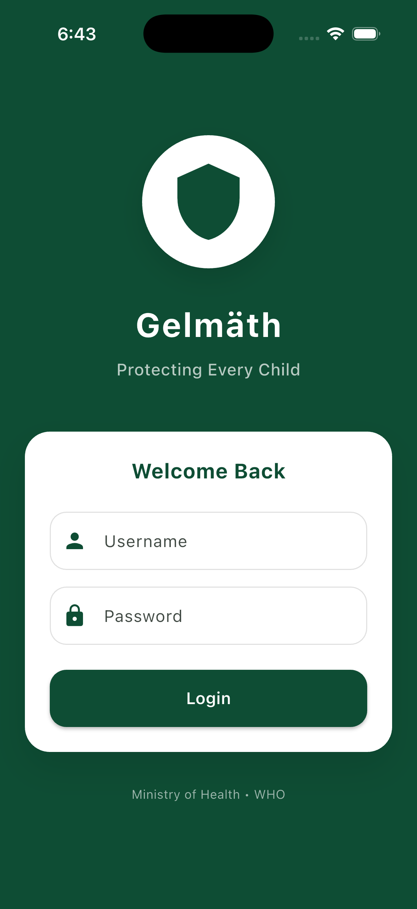
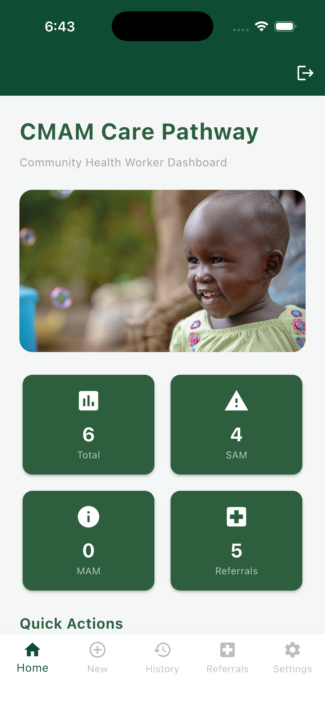
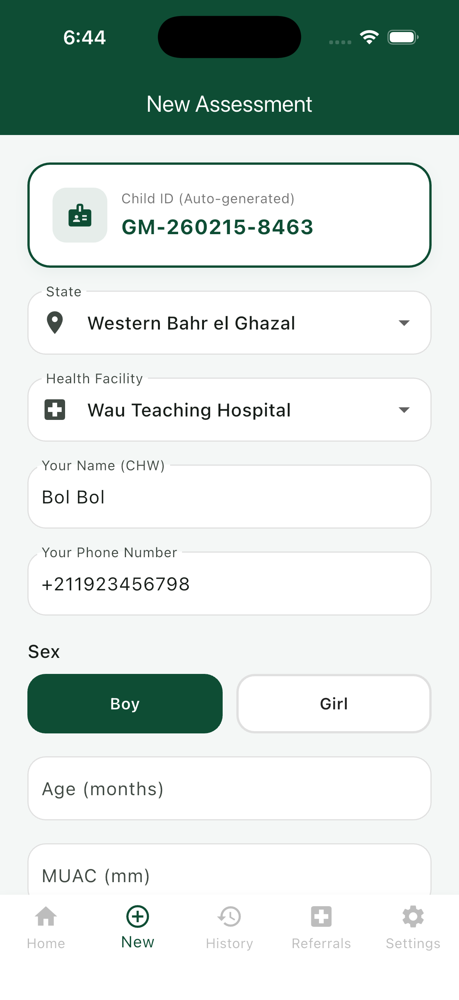
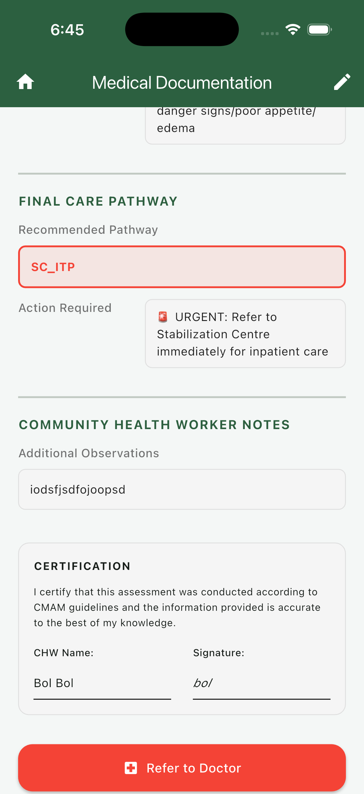
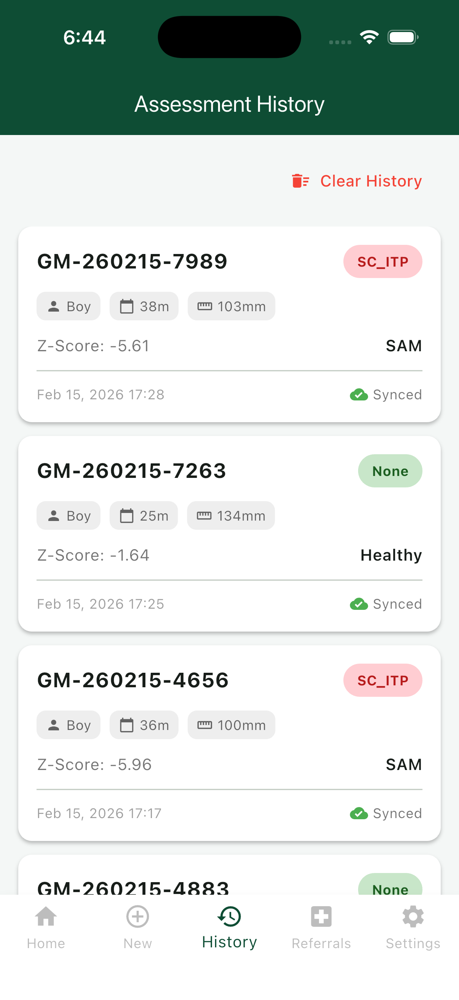
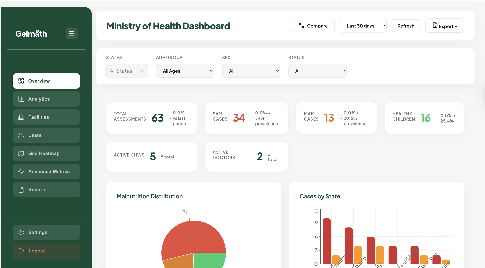
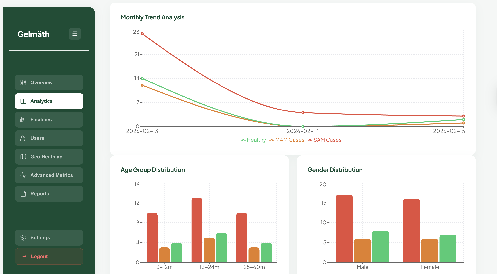
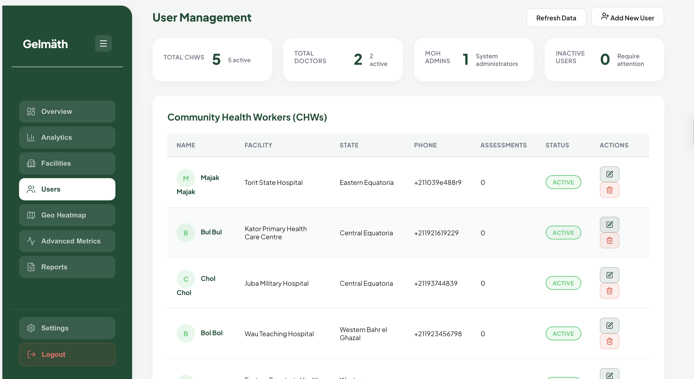

# Gelmëth System - Community-based Management of Acute Malnutrition

[](https://opensource.org/licenses/MIT)
[](https://www.python.org/downloads/)
[](https://flutter.dev/)
[](https://reactjs.org/)

> **AI-powered malnutrition screening system based on WHO guidelines and South Sudan CMAM 2017 standards**

---

## 📋 Table of Contents

- [Description](#-description)
- [GitHub Repository](#-github-repository)
- [Features](#-features)
- [Dataset](#-dataset)
- [Project Structure](#-project-structure)
- [Environment Setup](#-environment-setup)
- [Designs & Screenshots](#-designs--screenshots)
- [Deployment Plan](#-deployment-plan)
- [Models](#-models)
- [Performance](#-performance)
- [License](#-license)

---

## Description

The **CMAM ML System** is a comprehensive machine learning solution for screening and managing acute malnutrition in children aged 6-59 months. Built on the **Community Management of Acute Malnutrition (CMAM) guidelines from South Sudan 2017**, this system combines:

- **Two ML Models**: Pathway classification (94% accuracy) and quality checking (89% accuracy)
- **Three Deployment Options**: Mobile app (Flutter), Web dashboard (React), and REST API (Django)
- **Offline-First Architecture**: Works in remote areas without internet connectivity
- **WHO Compliance**: Uses official WHO LMS tables for Z-score calculation

### Problem Statement

Malnutrition affects millions of children in developing countries. Community Health Workers (CHWs) need:
- Quick, accurate screening tools
- Offline capability for remote areas
- Evidence-based care pathway recommendations
- Quality control for measurements

### Solution

Our system provides:
1. **Real-time ML predictions** for care pathways (SC-ITP, OTP, TSFP)
2. **Quality gatekeeper** to detect measurement errors
3. **Offline-first mobile app** for field workers
4. **MoH dashboard** for program monitoring
5. **WHO-compliant** Z-score calculations

---

## 🔗 GitHub Repository

```bash
git clone https://github.com/YOUR_USERNAME/CMAM_ML_System.git
cd CMAM_ML_System
```

## 🎥 Live Demo

**Watch the system in action:**
[📹 Video Demo](https://drive.google.com/file/d/1UIaIGhSSmQai5rPlmaBEfCwrq0OSTckO/view?usp=sharing)

The demo showcases:
- Mobile app assessment workflow
- Real-time ML predictions
- Doctor dashboard analytics
- MoH dashboard overview
- Offline-first capabilities

**Repository Structure:**
```
CMAM_ML_System/
├── Dataset/              # Training data and CMAM guidelines
├── Models/               # Trained ML models (.pkl files)
├── Notebooks/            # Jupyter notebooks for training
├── cmam_mobile_app/      # Flutter mobile application
├── cmam_backend/         # Django REST API
├── gelmath_web/          # React dashboard
└── README.md             # This file
```

---

## Features

### 🤖 Machine Learning
- **Model 1**: Care pathway classifier (SAM/MAM/Healthy → SC-ITP/OTP/TSFP)
- **Model 2**: Quality checker (detects measurement errors)
- Random Forest ensemble (100 trees, depth 10)
- 94% accuracy on pathway classification
- 89% accuracy on quality detection

### 📱 Mobile App (Flutter)
- Offline-first with SQLite
- Real-time ML predictions
- WHO Z-score calculation
- CMAM guideline validation
- Auto-sync when online
- Modern UI (dark green theme)

### 🌐 Web Dashboard (React)
- MoH analytics dashboard
- Interactive visualizations (Recharts)
- Geographic mapping (Leaflet)
- PDF report generation
- User management
- Responsive design

### REST API (Django)
- RESTful endpoints
- JWT authentication
- Model integration
- Swagger documentation
- PostgreSQL/SQLite support

---

## Dataset

### Source: CMAM South Sudan 2017 Guidelines

Our dataset is from **Community Management of Acute Malnutrition (CMAM) South Sudan** and guilded by the guidelines from the Ministry of Health, South Sudan. This comprehensive document provides:

- **Clinical protocols** for SAM/MAM management
- **Admission criteria** based on MUAC and edema
- **Care pathway definitions** (SC-ITP, OTP, TSFP)
- **WHO reference standards** for children 6-59 months

**Document:** `Dataset/CMAM guidelines south sudan 2017.pdf`

### Dataset Composition

#### 1. **Clean Dataset** 
- **Age Range**: 6-59 months (WHO standard)
- **Features**:
  - `child_id`: Unique identifier
  - `sex`: M/F
  - `age_months`: 6-59 months
  - `muac_mm`: Mid-Upper Arm Circumference (95-145mm)
  - `edema`: 0 (none), 1 (mild), 2 (moderate), 3 (severe)
  - `appetite`: good/poor
  - `danger_signs`: 0/1
  - `label_pathway`: OTP/SC_ITP/TSFP

- **Distribution**:
  - **TSFP** (MAM): 1,846 samples (46%)
  - **OTP** (SAM, uncomplicated): 1,416 samples (35%)
  - **SC_ITP** (SAM, complicated): 738 samples (19%)

#### 2. **Quality Dataset** (8,093 samples)
- **Purpose**: Train Model 2 to detect measurement errors
- **Composition**:
  - 2,313 clean samples (OK)
  - 5,780 corrupted samples (SUSPICIOUS)
- **Error Types**:
  - **Noise**: Random measurement variations
  - **Unit errors**: mm→cm conversion mistakes (11.4 instead of 114)
  - **Age errors**: Multiplication errors (240 instead of 24)
  - **Missing fields**: Incomplete data (edema=-1)

### 🚫 Why Image Data Was Excluded

**Decision Rationale** (from `Notebooks/Image_data_visualization.ipynb`):

After analyzing potential image-based approaches for edema detection, we decided to **exclude image data** for the following reasons:

#### 1. **Data Distribution Issues**
- **Age Focus**: Our target population is 6-59 months (WHO standard)
- **Limited Image Availability**: Insufficient labeled images for this specific age range
- **Class Imbalance**: Severe imbalance in SAM/MAM/Healthy categories in available image datasets

#### 2. **Clinical Status Distribution**
```
Target Distribution (6-59 months):
- Total children (6-59 months): 184

- Distribution by nutrition status (counts):
nutrition_status
Healthy    173
MAM          7
SAM          4


- Distribution by nutrition status (percentages):
nutrition_status
Healthy    94.02
MAM         3.80
SAM         2.17

Available Image Data:
- Heavily skewed toward severe cases
- Insufficient representation of MAM
- Age range inconsistencies
```

#### 3. **Practical Constraints**
- **Field Conditions**: Poor lighting, camera quality variations
- **Privacy Concerns**: Ethical issues with child images
- **Storage**: Large image datasets impractical for offline mobile app
- **Processing**: Real-time image analysis too slow for field use

#### 4. **CMAM Guidelines Alignment**
The official CMAM South Sudan 2017 guidelines prioritize:
- **MUAC measurement** (primary indicator)
- **Edema assessment** (clinical observation, not image-based)
- **Appetite test** (behavioral observation)
- **Danger signs** (clinical checklist)

**Conclusion**: We focused on **structured clinical data** (MUAC, age, edema grade, appetite, danger signs) which:
-  Aligns with CMAM protocols
-  Works offline without image processing
-  Provides consistent, reliable measurements
-  Achieves 94% accuracy without images

---

## 📁 Project Structure

```
CMAM_ML_System/
│
├── 📂 Dataset/
│   ├── CMAM guidelines south sudan 2017.pdf    # Official guidelines
│   ├── cmam_4000_93pct.csv                     # Clean training data
│   ├── quality_train_20260209_220137.csv       # Quality dataset (train)
│   ├── quality_val_20260209_220137.csv         # Quality dataset (val)
│   └── quality_test_20260209_220137.csv        # Quality dataset (test)
│
├── 📂 Models/
│   ├── cmam_model.pkl                          # Model 1: Pathway classifier
│   ├── model2_quality_classifier.pkl           # Model 2: Quality checker
│   ├── cmam_model_metadata.json                # Model 1 specifications
│   └── model2_metadata.json                    # Model 2 specifications
│
├── 📂 Notebooks/
│   ├── model_training.ipynb                    # Model 1 training
│   ├── model2_quality_training.ipynb           # Model 2 training
│   ├── Image_data_visualization.ipynb          # Image data analysis
│   └── cmam_cleaning_visualization.ipynb       # Data preprocessing
│
├── 📂 cmam_mobile_app/                         # Flutter mobile app
│   ├── lib/
│   │   ├── main.dart                           # App entry point
│   │   ├── models/                             # Data models
│   │   ├── services/                           # Business logic
│   │   ├── screens/                            # UI screens
│   │   └── widgets/                            # Reusable components
│   ├── assets/
│   │   └── images/                             # App images
│   └── pubspec.yaml                            # Flutter dependencies
│
├── 📂 cmam_backend/                            # Django REST API
│   ├── assessments/                            # Assessment endpoints
│   ├── analytics/                              # Analytics endpoints
│   ├── users/                                  # User management
│   ├── manage.py                               # Django CLI
│   └── requirements.txt                        # Python dependencies
│
├── 📂 gelmath_web/                             # React dashboard
│   ├── src/
│   │   ├── components/                         # React components
│   │   ├── pages/                              # Dashboard pages
│   │   └── services/                           # API services
│   └── package.json                            # Node dependencies
│
├── 📄 README.md                                # This file
├── 📄 ASSIGNMENT_ASSESSMENT.md                 # Detailed assessment
└── 📄 SUBMISSION_CHECKLIST.md                  # Quick summary
```

---

## 🛠️ Environment Setup

### Prerequisites

- **Python**: 3.13+ ([Download](https://www.python.org/downloads/))
- **Flutter**: 3.0+ ([Install](https://flutter.dev/docs/get-started/install))
- **Node.js**: 18+ ([Download](https://nodejs.org/))
- **Git**: Latest version

### 1️⃣ Clone Repository

```bash
git clone https://github.com/YOUR_USERNAME/CMAM_ML_System.git
cd CMAM_ML_System
```

### 2️⃣ Backend Setup (Django API)

```bash
cd cmam_backend

# Create virtual environment
python3 -m venv venv
source venv/bin/activate  # On Windows: venv\Scripts\activate

# Install dependencies
pip install -r requirements.txt

# Run migrations
python manage.py migrate

# Create superuser
python manage.py createsuperuser

# Load sample data (optional)
python seed_data.py

# Start server
python manage.py runserver
# API available at http://localhost:8000/api/
```

**Environment Variables** (create `.env` file):
```env
SECRET_KEY=your-secret-key-here
DEBUG=True
DATABASE_URL=sqlite:///db.sqlite3
ALLOWED_HOSTS=localhost,127.0.0.1
```

### 3️⃣ Mobile App Setup (Flutter)

```bash
cd cmam_mobile_app

# Install dependencies
flutter pub get

# Check devices
flutter devices

# Run on device/emulator
flutter run

# Build APK (Android)
flutter build apk --release

# Build iOS
flutter build ios --release
```

**Configuration** (`lib/services/api_service.dart`):
```dart
// For Android emulator
static const String baseUrl = 'http://10.0.2.2:8000/api';

// For iOS simulator
static const String baseUrl = 'http://localhost:8000/api';

// For physical device (use your computer's IP)
static const String baseUrl = 'http://192.168.1.100:8000/api';
```

### 4️⃣ Web Dashboard Setup (React)

```bash
cd gelmath_web

# Install dependencies
npm install

# Start development server
npm start
# Dashboard available at http://localhost:3000

# Build for production
npm run build
```

**Environment Variables** (create `.env` file):
```env
REACT_APP_API_URL=http://localhost:8000/api
REACT_APP_ENV=development
```

### 5️⃣ Jupyter Notebooks

```bash
# Install Jupyter
pip install jupyter notebook

# Start Jupyter
jupyter notebook

# Open notebooks in Notebooks/ folder
```

---

## Designs & Screenshots

### Mobile App Interface

#### 1. **Login Screen**

- Secure authentication
- CHW credentials
- Offline mode option
- Remember me functionality

#### 2. **Home Screen**

- Clean, intuitive navigation
- Dark green (#2D5F3F) primary color
- Quick access to assessment form
- Sync status indicator
- Recent assessments summary

#### 3. **Assessment Form**

- **Input Fields**:
  - Child ID
  - Sex (M/F)
  - Age (months)
  - MUAC (mm)
  - Edema grade (0-3)
  - Appetite (good/poor)
  - Danger signs checklist
- **Real-time Validation**
- **Offline Capability**
- **WHO Z-score calculation**

#### 4. **Results Screen**

- **Clinical Status**: SAM/MAM/Healthy
- **Care Pathway**: SC-ITP/OTP/TSFP
- **Confidence Score**: 0-100%
- **Quality Flag**: OK/SUSPICIOUS
- **CMAM Guideline Validation**
- **Action Buttons**: Save, Share, Print

#### 5. **History Screen**

- Past assessments list
- Sync status indicator
- Search and filter options
- Export functionality

### Web Dashboards

#### 1. **Doctor Dashboard**

- **Patient Management**:
  - Active cases list
  - Referral tracking
  - Follow-up scheduling
  - Treatment history
- **Clinical Tools**:
  - Assessment review
  - Prescription management
  - Progress monitoring
- **Communication**:
  - CHW coordination
  - Patient notes
  - Alerts and notifications

#### 2. **MoH Dashboard - Overview**

- **National Statistics**:
  - Total assessments
  - SAM/MAM/Healthy distribution
  - Trend analysis
  - Coverage metrics
- **Key Performance Indicators**:
  - Screening rate
  - Referral completion
  - Treatment success rate
  - Geographic coverage

#### 3. **MoH Dashboard - Analytics**

- **Data Visualizations**:
  - Interactive charts (Recharts)
  - Geographic mapping (Leaflet)
  - Time series analysis
  - Facility comparisons
- **Reports**:
  - Monthly summaries
  - Facility performance
  - Export to PDF/Excel
  - Custom date ranges

#### 4. **User Management**

- **Account Administration**:
  - CHW accounts
  - Doctor accounts
  - MoH staff accounts
- **Access Control**:
  - Role-based permissions
  - Facility assignments
  - Activity logs
- **Monitoring**:
  - Login history
  - Data quality metrics
  - System usage statistics

### System Architecture

```
┌─────────────────┐
│  Mobile App     │
│  (Flutter)      │
│  - Offline DB   │
│  - ML Models    │
│  - CHW Interface│
└────────┬────────┘
         │
         │ Auto-sync
         │
         ▼
┌─────────────────┐
│  REST API       │
│  (Django)       │
│  - Model 1 & 2  │
│  - PostgreSQL   │
│  - JWT Auth     │
└────────┬────────┘
         │
         ├─────────────────┬
         │                 │                 
         ▼                 ▼               
┌──────────────┐  ┌──────────────┐
│   Doctor     │  │     MoH      │
│  Dashboard   │  │  Dashboard   │
│  (React)     │  │  (React)     │
│              │  │              │
│ - Patients   │  │ - Analytics  │
│ - Referrals  │  │ - Reports    │
│ - Follow-ups │  │ - Maps       │
└──────────────┘  └──────────────┘
```

### Data Flow Diagram

```
Input → Quality Check (Model 2) → Z-Score Calc → Pathway Prediction (Model 1) → CMAM Gate → Action
  ↓           ↓                      ↓                    ↓                      ↓          ↓
MUAC      SUSPICIOUS?            Clinical            SC-ITP/OTP/TSFP        Validate    Refer
Age          ↓                    Status                   ↓                    ↓          ↓
Sex         OK                  SAM/MAM/Healthy      Confidence            Approve    Admit
Edema        ↓                      ↓                    Score                 ↓          ↓
Appetite   Proceed              Store Offline            ↓                  Display   Follow-up
Danger       ↓                      ↓                  Sync API                ↓
Signs      Model 1              Dashboard                                   CHW Action
```

---

## Deployment Plan

### Phase 1: Pilot Deployment 
first to second week of march

#### Week 1: Infrastructure Setup
- [ ] **Cloud Server**: AWS EC2 (t3.medium) or DigitalOcean Droplet
- [ ] **Database**: PostgreSQL 15+ (managed service)
- [ ] **Storage**: S3 for backups
- [ ] **Domain**: Register domain (e.g., cmam-southsudan.org)
- [ ] **SSL**: Let's Encrypt certificates

#### Week 2: Backend Deployment
```bash
# Production server setup
sudo apt update && sudo apt upgrade -y
sudo apt install python3.13 postgresql nginx

# Clone repository
git clone https://github.com/YOUR_USERNAME/CMAM_ML_System.git
cd CMAM_ML_System/cmam_backend

# Setup virtual environment
python3 -m venv venv
source venv/bin/activate
pip install -r requirements.txt gunicorn

# Configure Gunicorn
gunicorn cmam_project.wsgi:application --bind 0.0.0.0:8000

# Setup Nginx reverse proxy
sudo nano /etc/nginx/sites-available/cmam
```

**Nginx Configuration**:
```nginx
server {
    listen 80;
    server_name api.cmam-southsudan.org;

    location / {
        proxy_pass http://127.0.0.1:8000;
        proxy_set_header Host $host;
        proxy_set_header X-Real-IP $remote_addr;
    }

    location /static/ {
        alias /var/www/cmam/static/;
    }
}
```

#### Week 2: Web Dashboard Deployment
```bash
cd gelmath_web

# Build production bundle
npm run build

# Deploy to Netlify/Vercel
netlify deploy --prod

# Or serve with Nginx
sudo cp -r build/* /var/www/cmam/dashboard/
```

#### Week 2: Mobile App Distribution
- [ ] **Android**: Publish to Google Play Store
  ```bash
  flutter build appbundle --release
  # Upload to Play Console
  ```

- [ ] **Alternative**: APK direct distribution for pilot


### Backup & Disaster Recovery

```bash
# Daily database backups
0 2 * * * pg_dump cmam_db > /backups/cmam_$(date +\%Y\%m\%d).sql

# Weekly full system backup
0 3 * * 0 tar -czf /backups/system_$(date +\%Y\%m\%d).tar.gz /var/www/cmam

# Upload to S3
aws s3 sync /backups/ s3://cmam-backups/
```

### Security Measures

- [ ] **HTTPS**: SSL/TLS encryption
- [ ] **Authentication**: JWT tokens (24h expiry)
- [ ] **Authorization**: Role-based access control
- [ ] **Data Encryption**: AES-256 for sensitive data
- [ ] **Audit Logs**: Track all data access
- [ ] **Rate Limiting**: Prevent API abuse
- [ ] **Firewall**: UFW/iptables rules

### Maintenance Plan

#### Daily
- Monitor server health
- Check error logs
- Verify backups

#### Weekly
- Review user feedback
- Update documentation
- Security patches

#### Monthly
- Model retraining (if needed)
- Performance optimization
- Feature updates

---

## 🤖 Models

### Model 1: Care Pathway Classifier

**Purpose**: Predict appropriate care pathway based on clinical assessment

**Architecture**:
```python
RandomForestClassifier(
    n_estimators=100,
    max_depth=10,
    random_state=42,
    class_weight='balanced'
)
```

**Features** (6):
1. `sex_encoded` (0=F, 1=M)
2. `age_months_filled` (6-59)
3. `muac_mm` (95-145)
4. `edema` (0-3)
5. `appetite_encoded` (0=good, 1=poor)
6. `danger_signs` (0/1)

**Output Classes** (3):
- **SC-ITP**: Stabilization Center / Inpatient Therapeutic Program
- **OTP**: Outpatient Therapeutic Program
- **TSFP**: Targeted Supplementary Feeding Program

**Training**: `Notebooks/model_training.ipynb`

### Model 2: Quality Classifier

**Purpose**: Detect suspicious measurements before pathway prediction

**Architecture**:
```python
RandomForestClassifier(
    n_estimators=100,
    max_depth=10,
    min_samples_split=10,
    random_state=42,
    n_jobs=-1
)
```

**Features** (9):
1. `muac_mm`
2. `age_months`
3. `sex_encoded`
4. `edema`
5. `appetite_encoded`
6. `danger_signs`
7. `near_threshold` (derived)
8. `unit_suspect` (derived)
9. `age_suspect` (derived)

**Output Classes** (2):
- **OK**: Measurement appears valid
- **SUSPICIOUS**: Potential error detected

**Training**: `Notebooks/model2_quality_training.ipynb`

---

## 📈 Performance

### Model 1: Pathway Classifier

```
Test Set Accuracy: 94.05%

Classification Report:
              precision    recall  f1-score   support
         OTP       0.90      0.93      0.92       211
      SC_ITP       1.00      0.94      0.97       122
        TSFP       0.95      0.94      0.95       272

    accuracy                           0.94       605
   macro avg       0.95      0.94      0.94       605
weighted avg       0.94      0.94      0.94       605
```

### Model 2: Quality Classifier

```
Test Set Accuracy: 89.2%

Classification Report:
              precision    recall  f1-score   support
          OK       0.73      0.97      0.83       335
  SUSPICIOUS       0.99      0.86      0.92       879

    accuracy                           0.89      1214
   macro avg       0.86      0.92      0.88      1214
weighted avg       0.92      0.89      0.90      1214
```

**Feature Importance**:
1. MUAC: 31.74%
2. Edema: 16.79%
3. Age: 15.47%

---

## 📄 License

MIT License - See [LICENSE](LICENSE) file


---

## 🙏 Acknowledgments

- **Ministry of Health, South Sudan** - CMAM Guidelines 2017
- **World Health Organization (WHO)** - LMS reference tables

---

**Last Updated**: February 14, 2026

**Version**: 1.0.0
