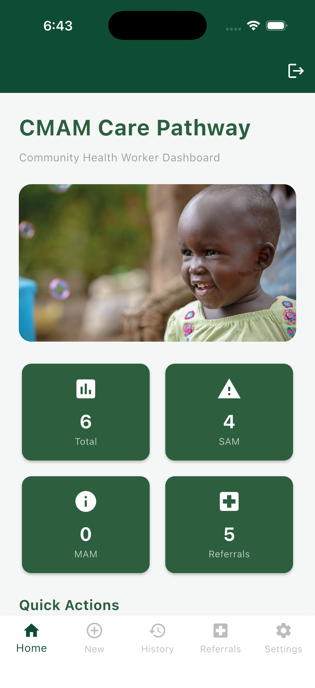
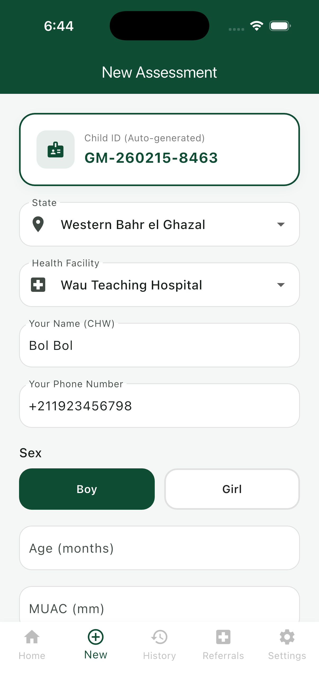
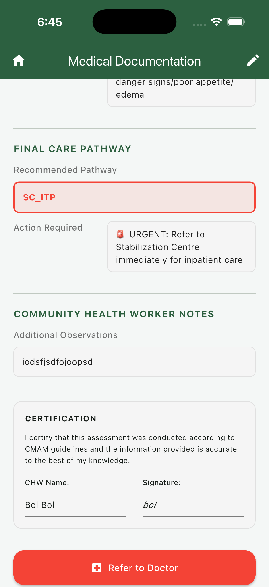
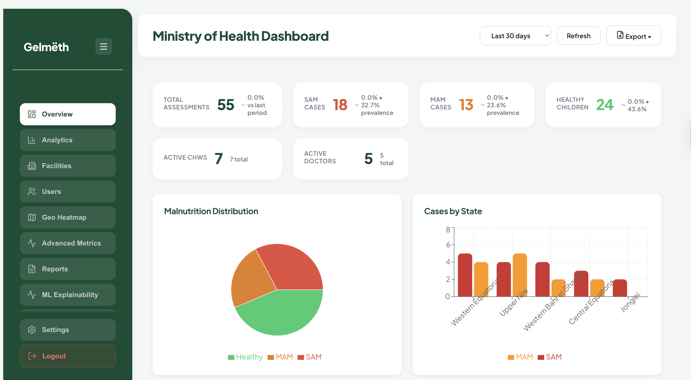
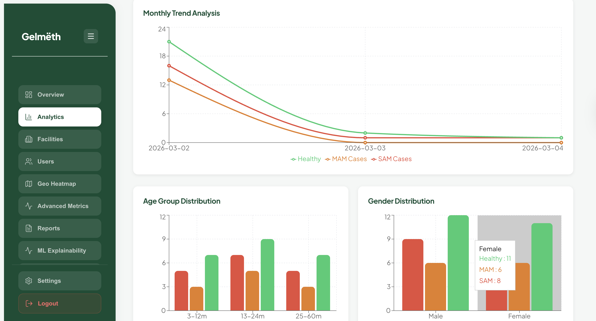
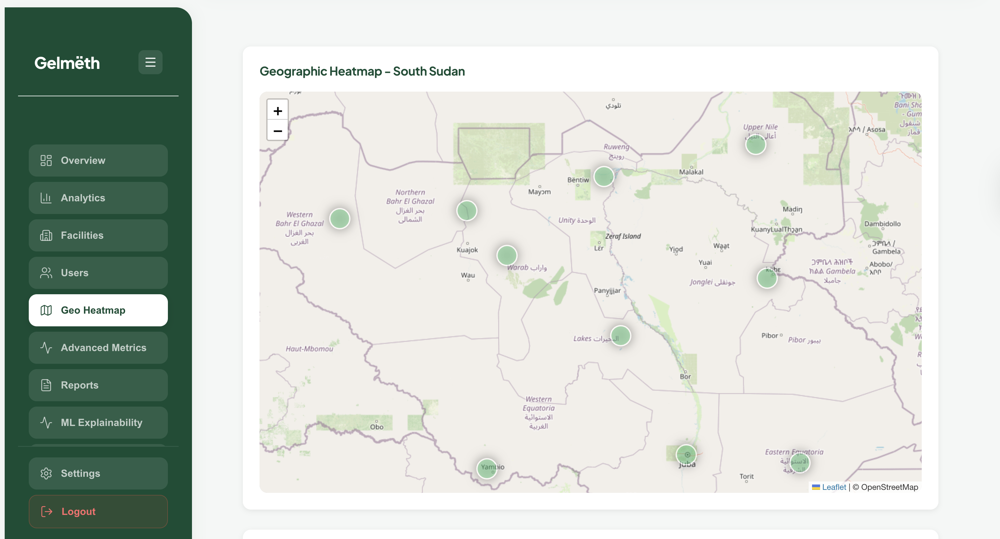
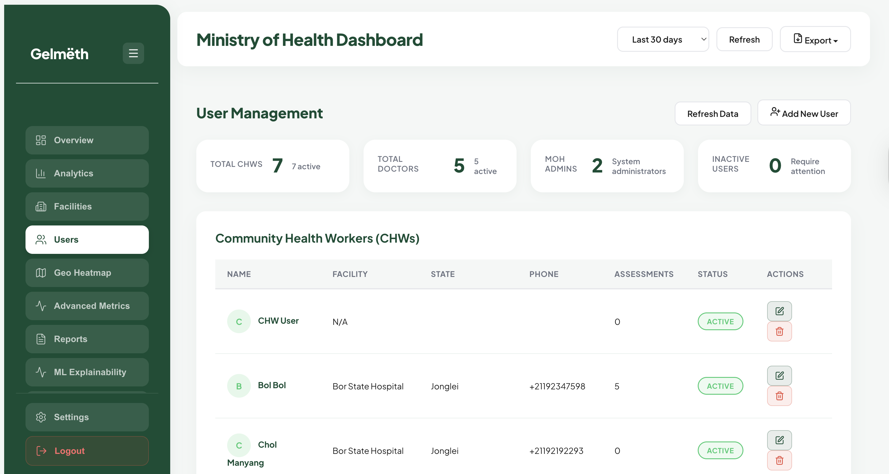
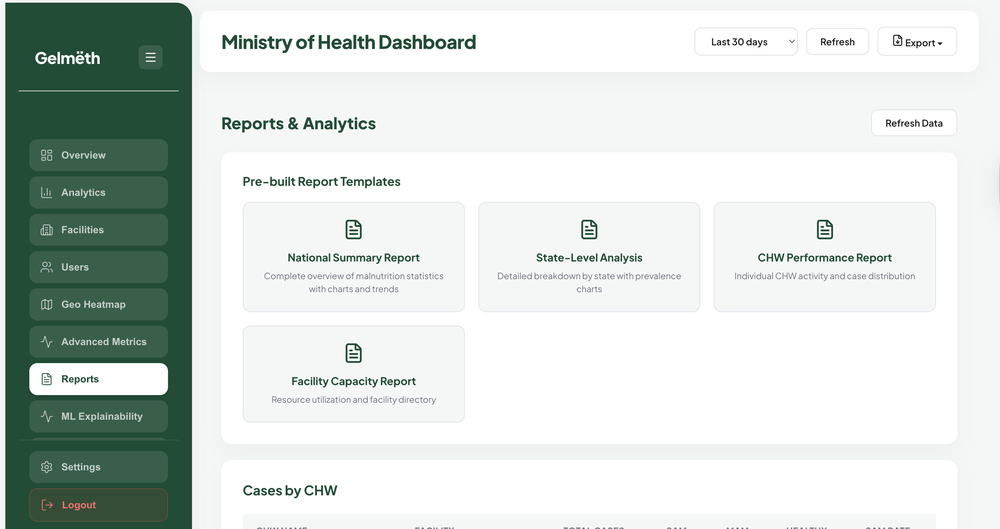
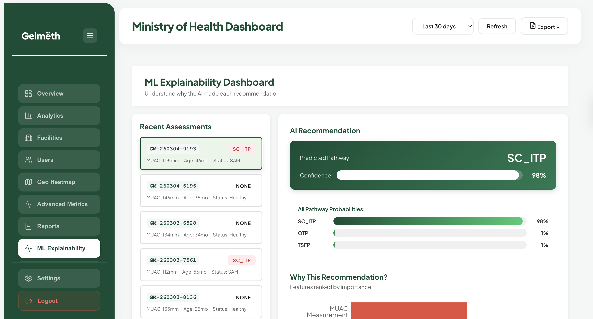

# Gelmëth — AI-Supported MUAC-for-Age Decision Support System

[](https://opensource.org/licenses/MIT)
[](https://www.python.org/downloads/)
[](https://flutter.dev/)
[](https://reactjs.org/)
[]()
[](https://orcid.org/0009-0008-3540-9494)

> **"Protect the child"** — *Gelmëth* in Dinka

An offline-first, full-stack AI decision support system for acute malnutrition screening among children aged 6–59 months in South Sudan. Built for community health workers operating in low-connectivity, resource-constrained humanitarian settings.

📄 **Paper:** *"Gelmëth: An AI-Supported MUAC-for-Age Decision Support System for Acute Malnutrition Screening in South Sudan"* — Submitted to IEEE Healthcom 2026

---

## The Problem

Over **2.3 million children** under five in South Sudan are acutely malnourished, including approximately 700,000 severe cases. Frontline screening relies on manual MUAC measurement — a simple tape around the arm — but the decision that follows is complex: which care pathway (TSFP, OTP, or SC-ITP) does this child need?

Manual interpretation is vulnerable to:
- Measurement errors and unit mistakes (cm entered instead of mm)
- Missing age records in conflict-affected settings
- Inconsistent referral decisions under high patient volumes
- No data validation or quality checking at point of care

Existing platforms (DHIS2, RapidPro, CommCare) handle national reporting. **None provide real-time clinical decision support at the point of care.**

---

## Live Deployment

### 🌐 Web Dashboard (Production)
**URL:** [https://gelm-th-project-as48.vercel.app](https://gelm-th-project-as48.vercel.app)

- Hosted on Vercel (HTTPS)
- Backend API on AWS EC2 via `https://api.deaglefarm.com/api`
- Real-time analytics and geographic visualisation
- Role-based access: CHW / Doctor / MoH Admin

### 📱 Mobile App (Android APK)
**Download:** [Download APK from Google Drive](https://drive.google.com/file/d/1AV3Zb5Yis3VW-4KI35jChzfXjSEs4H3P/view?usp=sharing)

- Version: 1.0.0 · Size: 24.3 MB
- Offline-first — full assessment works with zero internet
- ML inference on-device in under 5 seconds

> **Installation:** Enable "Install from unknown sources" → Settings → Apps → Special app access → Install unknown apps

### 🎥 Demo Video
**Watch Full System Demo:** [Google Drive](https://drive.google.com/drive/folders/1yYBXXQeaABqXsDZkCdAduWt2RBQH-fXQ?usp=sharing)

---

## ML Pipeline Performance

### Model 1 — Care Pathway Classifier
Recommends TSFP / OTP / SC-ITP based on MUAC, age, appetite, oedema, danger signs.

```
Test Set Accuracy: 94.05%

              precision    recall  f1-score   support
         OTP       0.90      0.93      0.92       211
      SC_ITP       1.00      0.94      0.97       122   ← Perfect precision
        TSFP       0.95      0.94      0.95       272

    accuracy                           0.94       605
```

**SC-ITP precision = 1.00** — the model never misclassifies a non-severe case as requiring inpatient stabilisation. This is the most critical clinical safety property of the system.

**Feature Importance:**
1. MUAC: 45.04%
2. Appetite: 28.96%
3. Danger Signs: 17.24%
4. Age: 4.69% · Oedema: 3.55% · Sex: 0.52%

### Model 2 — Quality Classifier
Detects suspicious or erroneous screening records before they enter the workflow.

```
Test Set Accuracy: 89.2%

              precision    recall  f1-score   support
          OK       0.73      0.97      0.83       335
  SUSPICIOUS       0.99      0.86      0.92       879   ← 99% precision

    accuracy                           0.89      1214
```

**SUSPICIOUS precision = 0.99** — minimises false alarms while catching real measurement errors.

---

## User Acceptance Testing Results

Conducted **March 2026** with **18 participants** — community health workers, nurses, and MoH administrators.

| Metric | Before Gelmëth | After Gelmëth | Change |
|--------|---------------|--------------|--------|
| Screening Confidence (1–10) | 4.2 | 8.9 | **+112%** |
| Time per Assessment | 8–12 min | 1–2 min | **−75%** |
| Perceived Accuracy (1–10) | 5.1 | 9.1 | **+78%** |
| Ease of Use (1–10) | — | 8.7 | — |
| Willingness to Recommend | — | **94%** | — |

The evaluation panel at the African Leadership University designated Gelmëth the **most complete capstone project** submitted in the cohort, commending the robust backend, clean system architecture, and thorough knowledge demonstrated.

---

## System Architecture

```
┌──────────────────────────────────────────────────────┐
│            Community Health Worker                   │
│        Flutter Mobile App (Offline-First)            │
│   SQLite local storage → auto-sync when online       │
└─────────────────────┬────────────────────────────────┘
                      │ HTTPS / JWT
┌─────────────────────▼────────────────────────────────┐
│          Django REST Framework Backend                │
│  • WHO MUAC-for-age Z-score computation (LMS)        │
│  • Model 1: Care Pathway Classifier inference        │
│  • Model 2: Quality Classifier inference             │
│  • Role-based access: CHW / Doctor / MoH Admin       │
│  • AES-256 encryption at rest and in transit         │
└─────────────┬──────────────────────┬─────────────────┘
              │                      │
┌─────────────▼──────────┐ ┌────────▼──────────────────┐
│  PostgreSQL (AWS RDS)  │ │  React 19 Web Dashboards  │
│  SQLite (Development)  │ │  Clinician + MoH Admin    │
└────────────────────────┘ │  Recharts + Leaflet maps  │
                           └───────────────────────────┘
```

---

## Tech Stack

| Layer | Technology |
|-------|-----------|
| Mobile App | Flutter 3.0, Dart, SQLite, Provider, flutter_secure_storage |
| Backend API | Django 6.0, Django REST Framework, Python 3.13 |
| Authentication | JWT (djangorestframework-simplejwt) |
| ML Pipeline | scikit-learn 1.8, Random Forest, joblib, SHAP |
| Web Dashboard | React 19, Recharts, Leaflet, React Router 7, jsPDF |
| Database | PostgreSQL 15 (production), SQLite (development) |
| Deployment | AWS EC2, AWS RDS, AWS S3, AWS CloudFront, Vercel |
| Security | AES-256, OWASP Top 10 verified, role-based access control |
| Data Processing | NumPy 2.4, Pandas 3.0, Matplotlib, Seaborn |
| ML Explainability | SHAP (SHapley Additive exPlanations) |

---

## Repository Structure

```
Gelm-th_project/
│
├── Dataset/
│   ├── CMAM guidelines south sudan 2017.pdf
│   ├── cmam_4000_93pct.csv                      # Validated training data (3,864 records)
│   ├── quality_train_20260209_220137.csv
│   ├── quality_val_20260209_220137.csv
│   └── quality_test_20260209_220137.csv
│
├── Models/
│   ├── cmam_model.pkl                           # Model 1: Care Pathway Classifier
│   ├── model2_quality_classifier.pkl            # Model 2: Quality Classifier
│   ├── cmam_model_metadata.json
│   └── model2_metadata.json
│
├── Notebooks/
│   ├── model_training.ipynb                     # Model 1 training & evaluation
│   ├── model2_quality_training.ipynb            # Model 2 training & evaluation
│   ├── cmam_cleaning_visualization.ipynb        # Data preprocessing & EDA
│   └── Image_data_visualization.ipynb           # Image data analysis (excluded)
│
├── cmam_mobile_app/                             # Flutter offline-first mobile app
│   ├── lib/
│   │   ├── main.dart
│   │   ├── models/
│   │   ├── services/                            # API, local DB, ML inference
│   │   ├── screens/                             # Assessment, results, history
│   │   └── widgets/
│   └── pubspec.yaml
│
├── cmam_backend/                                # Django REST Framework API
│   ├── assessments/
│   ├── analytics/
│   ├── users/
│   ├── manage.py
│   └── requirements.txt
│
├── gelmath_web/                                 # React dashboard (MoH + Doctor)
│   ├── src/
│   │   ├── components/
│   │   ├── pages/
│   │   └── services/
│   └── package.json
│
└── README.md
```

---

## Getting Started

### Prerequisites
- Python 3.13+
- Flutter 3.0+
- Node.js 18+
- PostgreSQL 15 (or SQLite for development)

### Backend Setup
```bash
cd cmam_backend
python -m venv venv
source venv/bin/activate        # Windows: venv\Scripts\activate
pip install -r requirements.txt
python manage.py migrate
python manage.py createsuperuser
python manage.py runserver
# API at http://localhost:8000/api/
```

**Environment variables** (`.env`):
```env
SECRET_KEY=your-secret-key
DEBUG=True
DATABASE_URL=sqlite:///db.sqlite3
ALLOWED_HOSTS=localhost,127.0.0.1
```

### Mobile App
```bash
cd cmam_mobile_app
flutter pub get
flutter run
# For production build:
flutter build apk --release
```

### Web Dashboard
```bash
cd gelmath_web
npm install
npm start
# Dashboard at http://localhost:3000
```

### ML Notebooks
```bash
pip install jupyter notebook
jupyter notebook
# Open notebooks in Notebooks/ folder
```

---

## Screenshots

### Mobile App
| Home | Assessment Form | Results |
|------|----------------|---------|
|  |  |  |

### Web Dashboard
| MoH Overview | Analytics | Geo Heatmap |
|-------------|-----------|-------------|
|  |  |  |

| Users | Reports | ML Explainability |
|-------|---------|------------------|
|  |  |  |

---

## Dataset

**Source:** South Sudan CMAM Guidelines 2017 (Ministry of Health, South Sudan)

- **4,000** clinical records following CMAM admission protocols
- After quality validation: **3,864** validated records
- Features: MUAC (mm), age (months), sex, bilateral oedema, appetite, danger signs
- Labels: TSFP (46.2%), OTP (35.4%), SC-ITP (18.5%)
- Split by unique child identifier (70/15/15) to prevent data leakage from repeat visits

**Quality dataset:** 8,093 records with synthetic data quality issues introduced for Model 2 training.

---

## Ethical Considerations

- Informed consent obtained from all caregivers during UAT
- AES-256 encryption for all paediatric data at rest and in transit
- Role-based access control: CHW / Doctor / MoH Admin
- Data minimisation — only clinically necessary fields collected
- Personally identifiable information separated from clinical measurements
- AI supports, **never replaces**, clinical judgement — severe cases require clinician confirmation
- Compliant with ALU ethical research guidelines and Declaration of Helsinki

---

## Citation

If you use this work, please cite:

```bibtex
@inproceedings{dau2026gelmeth,
  title     = {Gelm\"{e}th: An AI-Supported MUAC-for-Age Decision Support
               System for Acute Malnutrition Screening in South Sudan},
  author    = {Dau, Chol Daniel Deng and Ntohsi, Samiratu},
  booktitle = {Proceedings of the IEEE International Conference on
               E-health Networking, Application and Services (Healthcom)},
  year      = {2026}
}
```

---

## Authors

**Chol Daniel Deng Dau** — Lead Developer & Researcher
BSc (Hons) Software Engineering, African Leadership University, Kigali, Rwanda
[GitHub](https://github.com/Dau2004) · [Email](mailto:choldaniel700@gmail.com) · [ORCID: 0009-0008-3540-9494](https://orcid.org/0009-0008-3540-9494)

**Samiratu Ntohsi** — Supervisor
Faculty, Software Engineering, African Leadership University, Kigali, Rwanda
[Email](mailto:sntohsi@alueducation.com)

---

## Acknowledgements

- Ministry of Health, South Sudan — CMAM Guidelines 2017
- World Health Organization (WHO) — LMS reference tables for MUAC-for-age Z-score computation
- The 18 community health workers, nurses, and MoH administrators who participated in UAT

---

## License

MIT License — see [LICENSE](LICENSE) for details.

---

*Built for the children of South Sudan.*

**Version:** 1.0.0 · **Last Updated:** April 2026
